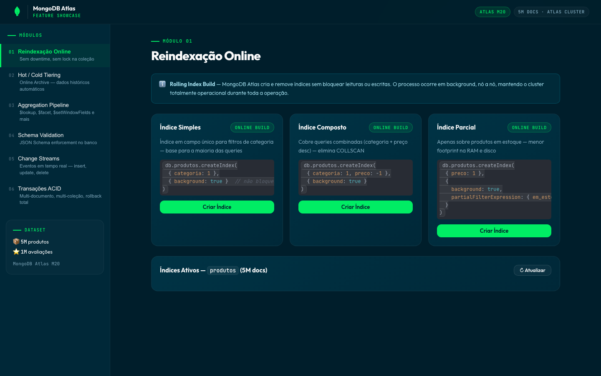
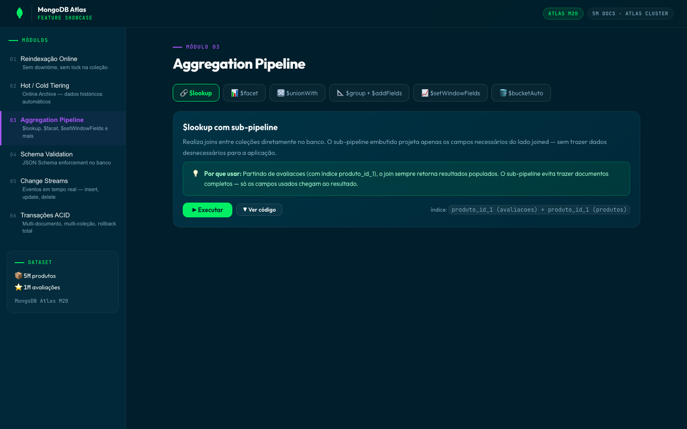
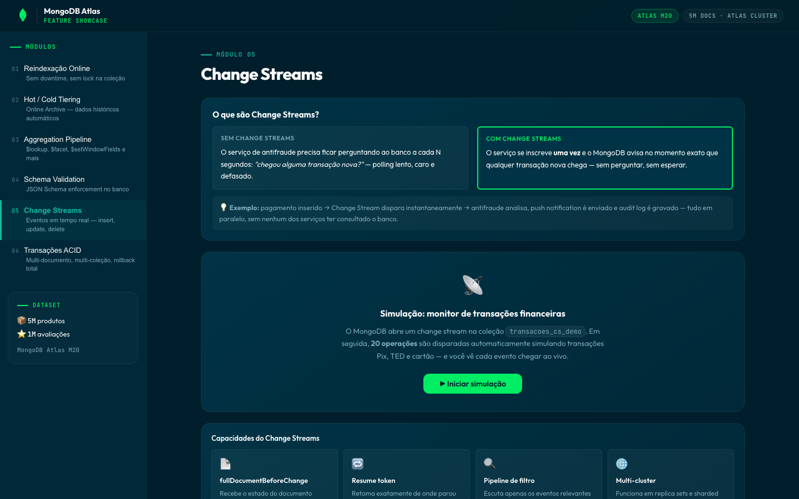
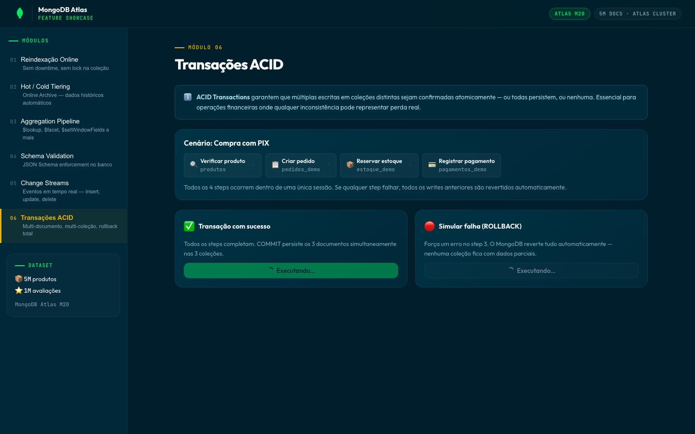

# MongoDB Atlas Feature Showcase

An interactive demo app built with **FastAPI** + **React 18** that walks through six core MongoDB Atlas capabilities — live, against a real 5M-document cluster.



---

## Features

| Module | What it shows |
|---|---|
| ⚡ **Online Reindexing** | Rolling index builds with zero downtime or collection locks |
| 🌡️ **Hot / Cold Tiering** | Online Archive — automatic tiering of historical data via Atlas Admin API |
| 🔗 **Aggregation Pipeline** | `$lookup` with sub-pipeline, `$facet`, `$unionWith`, `$setWindowFields`, `$bucketAuto` |
| 🛡️ **Schema Validation** | JSON Schema enforcement at the database layer (enum, regex, ranges, required fields) |
| 📡 **Change Streams** | Real-time event feed — insert, update, delete — with `fullDocumentBeforeChange` and resume tokens |
| 🔒 **ACID Transactions** | Multi-document, multi-collection transactions with step-by-step visualization and rollback demo |

Each module is deep-linkable (`/#agg`, `/#streams`, `/#tx`, …) and the UI supports light and dark mode.

| Aggregation Pipeline | Change Streams | ACID Transactions |
|---|---|---|
|  |  |  |

---

## Stack

- **Backend** — Python 3.11, FastAPI, PyMongo, Uvicorn
- **Frontend** — React 18, Vite, plain CSS (LeafyGreen design tokens)
- **Database** — MongoDB Atlas M20, 5M `produtos` + 1M `avaliacoes` documents

---

## Getting Started

### Prerequisites

- Python 3.11+
- Node.js 18+
- A MongoDB Atlas cluster (M10 or higher for transactions and change streams)

### 1. Clone

```bash
git clone https://github.com/adrianofratelli-glitch/mongodb-atlas-feature-showcase.git
cd mongodb-atlas-feature-showcase
```

### 2. Backend

```bash
cd backend
python -m venv venv
source venv/bin/activate        # Windows: venv\Scripts\activate
pip install -r requirements.txt
```

Copy the environment template and fill in your values:

```bash
cp .env.example .env
```

```env
MONGO_URI=mongodb+srv://<user>:<password>@<cluster>.mongodb.net/
MONGO_DB=POC
ATLAS_PUBLIC_KEY=your_atlas_public_key
ATLAS_PRIVATE_KEY=your_atlas_private_key
ATLAS_PROJECT_ID=your_atlas_project_id
ATLAS_CLUSTER=your_cluster_name
```

Seed the database with synthetic demo data (required on a fresh cluster):

```bash
python seed_data.py            # 100k products + 20k reviews — fast, enough for all demos
python seed_data.py --full     # 5M products + 1M reviews — full-scale demo dataset
```

Start the API:

```bash
uvicorn main:app --reload --port 8002
```

### 3. Frontend

```bash
cd frontend
npm install
npm run dev
```

Open [http://localhost:5174](http://localhost:5174).

---

## Dataset

The demo is designed around two collections, generated by `backend/seed_data.py`:

| Collection | Documents (full) | Description |
|---|---|---|
| `produtos` | ~5 000 000 | E-commerce products with price, category, stock, ratings |
| `avaliacoes` | ~1 000 000 | Product reviews linked by `produto_id` |

The seed script also creates all indexes the demos rely on. The default (100k/20k) run takes a couple of minutes and is enough to exercise every module; `--full` reproduces the original large-scale dataset.

---

## Project Structure

```
.
├── backend/
│   ├── main.py                  # FastAPI app + CORS
│   ├── database.py              # MongoClient singleton
│   ├── requirements.txt
│   ├── .env.example             # Environment template (copy to .env)
│   └── routers/
│       ├── reindexacao.py       # Online index management
│       ├── hot_cold.py          # Online Archive (Atlas Admin API)
│       ├── aggregations.py      # All 6 pipeline demos
│       ├── schema_validation.py # JSON Schema collMod demo
│       ├── change_streams.py    # Real-time change stream watcher
│       └── transactions.py      # ACID multi-doc transactions
└── frontend/
    ├── src/
    │   ├── App.jsx              # Shell, sidebar, dark mode
    │   ├── index.css            # LeafyGreen design tokens
    │   ├── hooks/useApi.js      # Fetch wrapper
    │   └── pages/
    │       ├── Reindexacao.jsx
    │       ├── HotCold.jsx
    │       ├── Aggregations.jsx
    │       ├── SchemaValidation.jsx
    │       ├── ChangeStreams.jsx
    │       └── Transactions.jsx
    └── vite.config.js
```

---

## Live Monitor (optional)

`live_monitor.py` is a terminal-based monitor that shows real-time read/write latency on the cluster — useful during a live demo to prove the cluster stays operational during reindexing.

```bash
python live_monitor.py
```

---

## Notes

- Change Streams require a **replica set** or **sharded cluster** (Atlas M10+).
- ACID Transactions require MongoDB 4.0+ with a replica set.
- The Hot/Cold Tiering module calls the Atlas Admin API — `ATLAS_PUBLIC_KEY`, `ATLAS_PRIVATE_KEY`, `ATLAS_PROJECT_ID`, and `ATLAS_CLUSTER` must be set.
- `backend/.env` is gitignored — never commit real credentials.

---

## License

MIT
