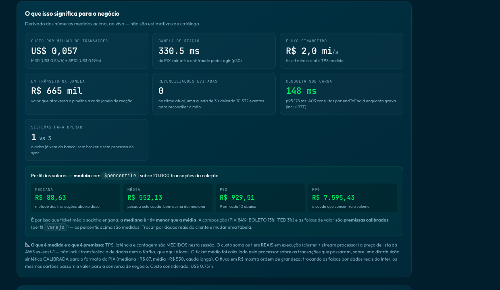

# MongoDB Atlas Feature Showcase

An interactive demo application that exercises seven core MongoDB Atlas capabilities
against a live cluster. Built with FastAPI and React 18.

> The application UI is in Portuguese (pt-BR).


## Features

| Module | Description |
|---|---|
| Online Reindexing | Rolling index builds with no downtime and no collection locks |
| Hot / Cold Tiering | Online Archive for automatic tiering of historical data through the Atlas Admin API |
| Aggregation Pipeline | `$lookup` with sub-pipeline, `$facet`, `$unionWith`, `$setWindowFields`, `$bucketAuto` |
| Schema Validation | JSON Schema enforcement at the database layer (enum, regex, ranges, required fields) |
| Change Streams | Real-time event feed (insert, update, delete) with `fullDocumentBeforeChange` and resume tokens |
| ACID Transactions | Multi-document, multi-collection transactions (`with_transaction` callback API) with step-by-step visualization and a rollback demo |
| Streaming | The three ways to react to change in Atlas, side by side, fed by one live write stream: Change Streams, MongoDB Kafka Connector and Atlas Stream Processing |

Every module is deep-linkable through the URL hash (`/#agg`, `/#streams`, `/#tx`, and so on).

## What changed in this version

The old **Redis vs Change Streams** module is gone. It compared MongoDB against a
Redis that ran simulated in memory, so half the comparison was not real. Deleted
with it: the page, three React components that only it used, its backend router,
the standalone CLI demo under `demo_redis_vs_changestream/`, and every Redis
mention in the docs and dependencies.

In its place there is a **Streaming** module. One generator writes PIX-shaped
transactions to Atlas, and three consumers read the same writes at the same time:
Change Streams inside the app, the MongoDB Kafka Connector on a real broker, and
an Atlas Stream Processing job doing 10-second windows. Nothing is simulated.
If a piece is not set up, its column says so and the other two keep working.


### The three columns

Same data, three ways to consume it. Each column shows what it costs: events per
second, p50/p95/p99 latency, and the state of the thing that is actually running.


The button on the left column kills the change stream cursor for 3 seconds while
the generator keeps writing, then reopens it from the saved resume token. Events
that arrived during the gap come back marked as recovered. Next to it is the
oplog window, which is how long a consumer can stay down and still catch up.

### Numbers a manager can use

Throughput convinces engineers. The panel at the bottom turns the same
measurements into cost per million transactions, reaction time, money in flight,
and how many manual reconciliations a 3-second outage would create.



It also shows the value distribution measured with `$percentile` on the live
collection. The median sits about six times below the mean, which is the whole
reason an average ticket on its own is misleading.

## Screenshots

| Hot / Cold Tiering | Aggregation Pipeline |
|---|---|
|  |  |

| Schema Validation | Change Streams |
|---|---|
|  |  |

| ACID Transactions |
|---|
|  |

## Stack

- Backend: Python 3.11, FastAPI, PyMongo, Uvicorn
- Frontend: React 18, Vite, plain CSS
- Database: MongoDB Atlas, with `produtos` and `avaliacoes` collections
- Optional for the Streaming module: Kafka (local, via Homebrew or Docker) and an
  Atlas Stream Processing instance

## Getting Started

### Prerequisites

- Python 3.11+
- Node.js 18+
- A MongoDB Atlas cluster (transactions and change streams work on any replica set, including free/Flex tiers; Online Archive requires M10+)

### 1. Clone

```bash
git clone https://github.com/adrianofratelli-glitch/mongodb-atlas-feature-showcase.git
cd mongodb-atlas-feature-showcase
```

### 2. Backend

```bash
cd backend
python -m venv venv
source venv/bin/activate        # Windows: venv\Scripts\activate
pip install -r requirements.txt
```

Copy the environment template and fill in your own values:

```bash
cp .env.example .env
```

```env
MONGO_URI=mongodb+srv://<user>:<password>@<cluster>.mongodb.net/
MONGO_DB=POC
ATLAS_PUBLIC_KEY=your_atlas_public_key
ATLAS_PRIVATE_KEY=your_atlas_private_key
ATLAS_PROJECT_ID=your_atlas_project_id
ATLAS_CLUSTER=your_cluster_name
```

Seed the database with synthetic data (required on a fresh cluster):

```bash
python seed_data.py            # 100k products + 20k reviews, enough for every module
python seed_data.py --full     # 5M products + 1M reviews, full-scale dataset
```

Start the API:

```bash
uvicorn main:app --reload --port 8002
```

Before presenting, verify that MongoDB, the required collections, and the
mutation guard are ready:

```bash
curl http://localhost:8002/preflight
```

### 3. Frontend

```bash
cd frontend
npm install
npm run dev
```

Open http://localhost:5174.

Or start both processes with readiness checks:

```bash
./start.sh --foreground
```

## Streaming — setup

The Streaming module (`/#streaming`) shows the three ways to react to a change in
Atlas side by side, all fed by the same live write generator against
`pix.transacoes`. Column 1 (Change Streams) works with nothing but `MONGO_URI`.
Columns 2 and 3 need the setup below; without it they render as
**"não configurado"** with these instructions, and the rest of the module keeps
working. No panel ever shows synthetic data.

**1. Start Kafka locally.** Two ways to do it, pick one.

*Native (no Docker required, recommended on a laptop):*

```bash
brew install kafka          # once
./scripts/kafka-local.sh up # broker (KRaft) + Kafka Connect + MongoDB plugin
./scripts/kafka-local.sh status
./scripts/kafka-local.sh down
```

*Docker:*

```bash
docker compose -f docker-compose.streaming.yml up -d
```

Either way the `mongodb-kafka-connect` plugin is downloaded on the first run
only and cached locally, so later runs work offline. The native path uses
`localhost:9092` and the Docker path uses `localhost:19092`, so set
`KAFKA_BROKERS` in `backend/.env` accordingly.

**2. Register the source connectors** (reads `MONGO_URI` from `backend/.env`):

```bash
./scripts/setup-kafka-connector.sh      # 2 partitioned connectors (default)
./scripts/setup-kafka-connector.sh 1    # single connector, saturates at ~6,300 msg/s
```

It PUTs a `MongoSourceConnector` config on the Connect REST API
(`http://localhost:8083`) with `database=pix`, `collection=transacoes`,
`publish.full.document.only=true`, `startup.mode=copy_existing` and
`topic.prefix=atlas`, producing the topic `atlas.pix.transacoes`.
Inspect it live at http://localhost:8085.

**3. Create the Stream Processing Instance** (Atlas UI → Stream Processing):
create an SPI in the same region as the cluster. The processor reads the
cluster's change stream, so keeping them together saves a cross-region hop on
every window. Add an *Atlas Database* connection named `atlasCluster`, then:

```bash
# in backend/.env: ASP_ENABLED=true and ASP_CONNECTION_STRING=<SPI connection string>
mongosh "$ASP_CONNECTION_STRING" --file scripts/setup-asp.js
```

The processor reads the change stream of `pix.transacoes`, sends malformed
documents to a DLQ, aggregates 10-second tumbling windows by `uf` and `tipo`
(count, summed volume, average ticket) and `$merge`s each closed window into
`pix.metricas_janela`. The backend surfaces those windows by watching that
collection with a change stream, so the stream processing result reaches the
screen through the same mechanism as column 1.

Tear everything down with `./scripts/teardown-streaming.sh` (add `--volumes` to
drop the cached plugin).

**Cleaning up between runs.** `POST /streaming/reset` (the **Reset** button) is
the real cleanup: it clears `transacoes`, `metricas_janela` and `dlq` and zeroes
every counter. Above 300k documents it drops and recreates the collection, so
half a million documents take about 10 seconds instead of timing out.

The 30-minute TTL index on `ts` (`STREAMING_TTL_SEGUNDOS`) is the safety net for
when you forget to reset, not the main mechanism. The window is deliberately
longer than any demo burst. In steady state the TTL deleter removes at the same
rate you insert: 10k/s in is 10k/s deleted, whether the TTL is 2 minutes or 30.
A short window only guarantees that deletion competes with your peak while the
audience is watching, and it floods the oplog that the resume-token demo depends
on. A long window pushes the cleanup to after the presentation, on an idle
cluster.

Relevant environment variables: `STREAMING_DB`, `KAFKA_BROKERS`, `CONNECT_URL`,
`CONNECT_CONNECTOR_NAME`, `ASP_ENABLED`, `ASP_CONNECTION_STRING`,
`ASP_PROCESSOR_NAME`, `STREAMING_CS_PARTICOES` (consumer partitions, default 6),
`STREAMING_TTL_SEGUNDOS`, `TETO_MEDIDO_TPS` (display only), and
`CUSTO_CLUSTER_USD_HORA` / `CUSTO_ASP_USD_HORA` to override list prices.

### Transaction values

Real payment traffic is lopsided: lots of small transfers and a few big ones that
carry most of the money. Drawing values uniformly loses that, and the average
ticket comes out wrong. `PERFIS_VALORES` declares weighted value bands per
transaction type instead. Pick one with `STREAMING_PERFIL_VALORES`:

| Profile | Median | Mean | Mean ÷ median | Top 1% of volume |
|---|---|---|---|---|
| `varejo` (default) | R$ 91 | R$ 559 | 6.2× | 36% |
| `corpo_medio` | R$ 500 | R$ 1,252 | 2.5× | 18% |

Both keep the long tail. We tried a flat draw between R$ 100 and R$ 2,000: the
mean lands almost on the median (1.4×) and the top 1% ends up carrying 3% of the
volume, which is not what a payments flow looks like.

`GET /streaming/perfil-valores` returns the declared bands next to percentiles
measured with `$percentile` on the live collection. Swap the bands for the
client's own numbers and the business panel starts speaking about their traffic.

### Cost figures

The panel prices whatever tiers are running right now, read from Atlas. The
cluster auto-scales between M20 and M30, so a hardcoded price would be wrong half
the time. AWS us-east-1 list prices (M20 $0.20/h, M30 $0.54/h, SP10 $0.19/h,
SP30 $0.39/h) are in `PRECOS_USD_HORA`, and the two env vars above override them.
Data transfer is not counted, and Kafka runs locally here, so it costs nothing in
this setup.

### What the numbers mean

Everything on screen is measured against the running cluster. Where something is
an assumption, the UI says so.

**Measured:** sustained TPS (a 5-second sliding window, never the value you
asked for), events per second per column, p50/p95/p99 over every event, the
volume the processor aggregated, and the round trip to the cluster.

On this environment (M30 cluster, SP10 stream processing, 10 consumer
partitions) the ceiling is **9,500 TPS**. Change Streams handle 9,507 events/s
at p50 458 ms and the stream processor aggregates 9,483 tx/s.

Kafka needed partitioning to keep up. A single source connector runs one task per
collection and tops out near 6,300 msg/s, so `setup-kafka-connector.sh` registers
two connectors, each filtering part of the `particao` field into the same topic.
Two is the sweet spot: with four, Kafka reaches 9,565 msg/s but the stream
processor drops to 7,113 tx/s, because each connector is one more reader
competing for the oplog.

Past 9,500 the SP10 tier does not plateau, it falls back to about 7,500 tx/s. We
reproduced that twice. SP10 is a deliberate choice, since it is the cheapest tier
that carries this demo. Changing only the processor to SP30, nothing else,
handled 9,968 tx/s at the same 10,000 TPS input where SP10 had already given up.
The ceiling belongs to this environment, not to the product.

One thing that trips people up: a stream processor picks its tier when it
starts, from the workspace default unless you pass one. Reset restarts the
processor, so the workspace default is what the demo actually runs on.

**Assumptions,** labelled in the UI: the daily PIX volume, the 10% share and the
3× peak factor. They are only a ruler for the measured numbers, and the presets
(1,041 / 3,472 / 6,944 / 9,500 TPS) come from them.

**Sampled:** the per-event feeds show one frame every 120 ms, because a browser
tab cannot draw thousands of rows per second. The counters and percentiles behind
them still cover every event.

Latency includes the round trip to the cluster, which is printed above the
columns. Running this from Brazil against a US cluster adds about 200 ms of pure
distance to every number.

## Security model

The application contains intentionally destructive demonstrations (index and
collection removal, schema changes, and Online Archive administration). The
default local setup therefore:

- binds the launcher to `127.0.0.1`;
- accepts browser mutations only from the configured local origins;
- rejects remote mutations unless `DEMO_ADMIN_TOKEN` is configured;
- limits request bodies and validates user-controlled query parameters;
- returns request IDs instead of exposing internal exception details.

For a shared network, set a long random `DEMO_ADMIN_TOKEN` in `backend/.env`
and the same value as `VITE_DEMO_API_TOKEN` in `frontend/.env`. This protects
the PoV control surface but is not a replacement for production user
authentication or a reverse proxy.

## Dataset

The demos run against two collections, both generated by `backend/seed_data.py`:

| Collection | Documents (full) | Description |
|---|---|---|
| `produtos` | ~5,000,000 | E-commerce products: price, category, stock, ratings |
| `avaliacoes` | ~1,000,000 | Product reviews linked by `produto_id` |

The seed script also creates the indexes the demos depend on. The default run
(100k/20k) takes a couple of minutes and is enough to exercise every module.
Use `--full` to reproduce the large-scale dataset.

## Project Structure

```
.
├── backend/
│   ├── main.py                  # FastAPI app and CORS
│   ├── database.py              # MongoClient, timeouts and readiness
│   ├── security.py              # Mutation guard and defensive headers
│   ├── settings.py              # Centralized environment configuration
│   ├── requirements.txt
│   ├── .env.example             # Environment template (copy to .env)
│   └── routers/
│       ├── reindexacao.py       # Online index management
│       ├── hot_cold.py          # Online Archive (Atlas Admin API)
│       ├── aggregations.py      # Aggregation pipeline demos
│       ├── schema_validation.py # JSON Schema collMod demo
│       ├── change_streams.py    # Change stream watcher
│       ├── transactions.py      # ACID multi-document transactions
│       └── streaming.py         # Generator + Change Streams / Kafka / ASP (SSE)
└── frontend/
    ├── src/
    │   ├── App.jsx              # Shell, sidebar, navigation
    │   ├── index.css            # Design tokens and base styles
    │   ├── hooks/useApi.js      # Fetch wrapper
    │   └── pages/               # One component per module
    └── vite.config.js
```

## Live Monitor (optional)

`live_monitor.py` is a terminal monitor that prints live read and write latency
against the cluster. It is useful during a demo to show that the cluster stays
fully available while an index builds.

```bash
python live_monitor.py
```

## Notes

- Change Streams require a replica set or sharded cluster (every Atlas cluster qualifies, including free/Flex tiers).
- ACID Transactions require MongoDB 4.0 or later on a replica set.
- Online Archive (Hot/Cold Tiering) requires a dedicated cluster (M10+).
- The Hot/Cold Tiering module calls the Atlas Admin API, so `ATLAS_PUBLIC_KEY`,
  `ATLAS_PRIVATE_KEY`, `ATLAS_PROJECT_ID`, and `ATLAS_CLUSTER` must be set.
- `backend/.env` is gitignored. Never commit real credentials.
- Run `pip install -r backend/requirements-dev.txt && pytest` for backend tests.
- GitHub Actions builds both applications, runs tests/lint, and audits dependencies.

## License

MIT
