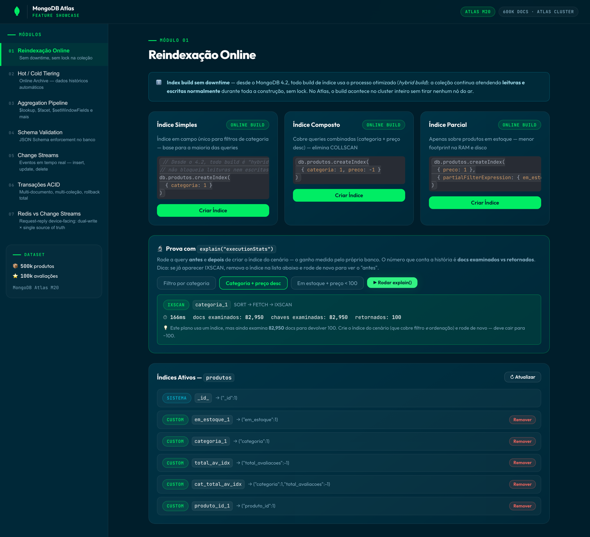
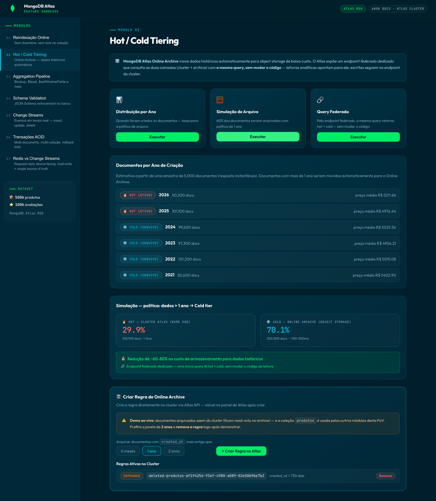
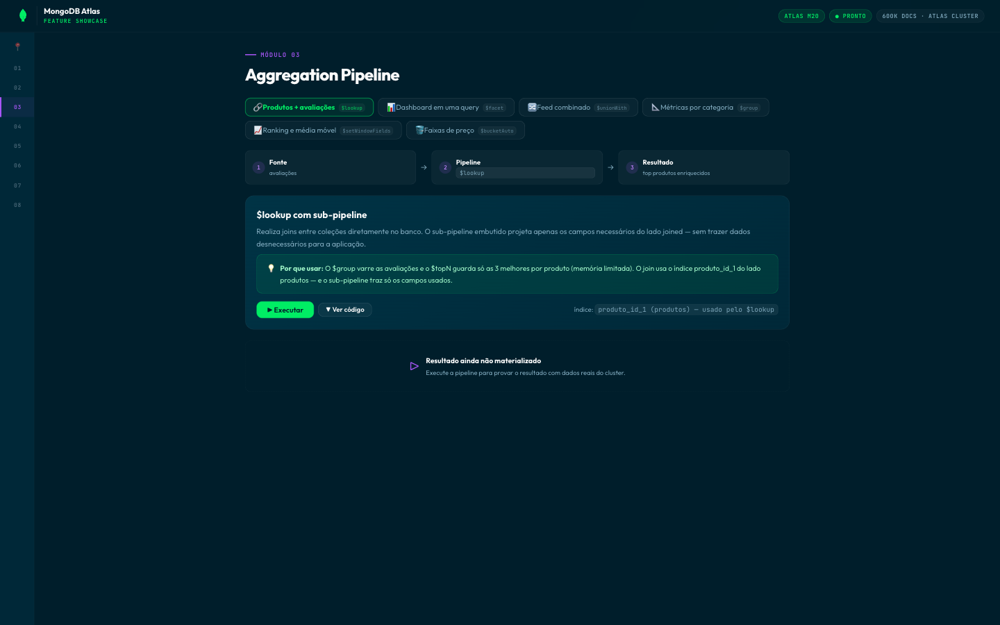
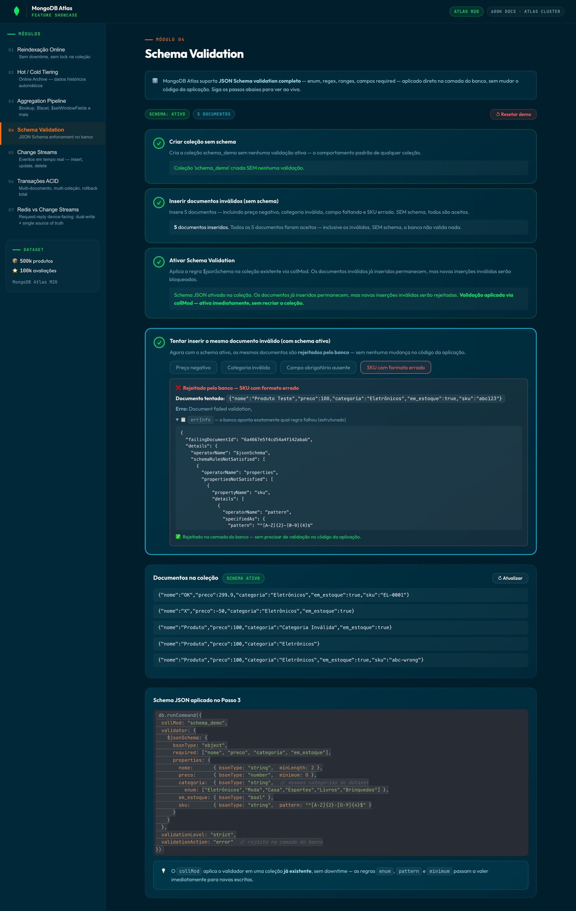
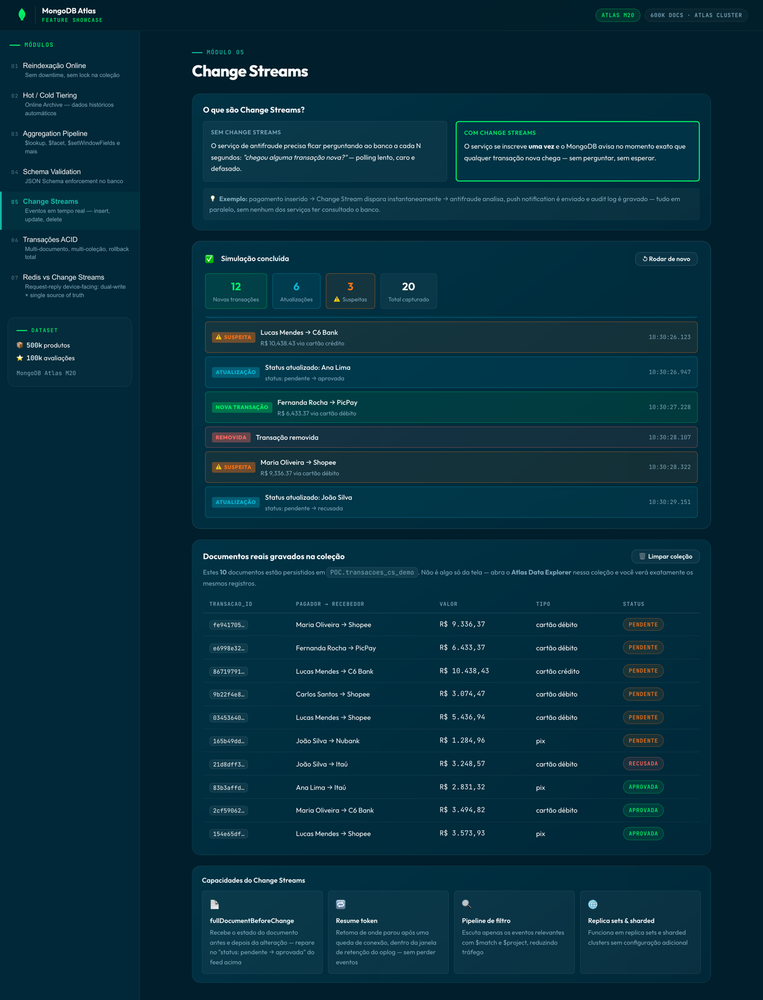
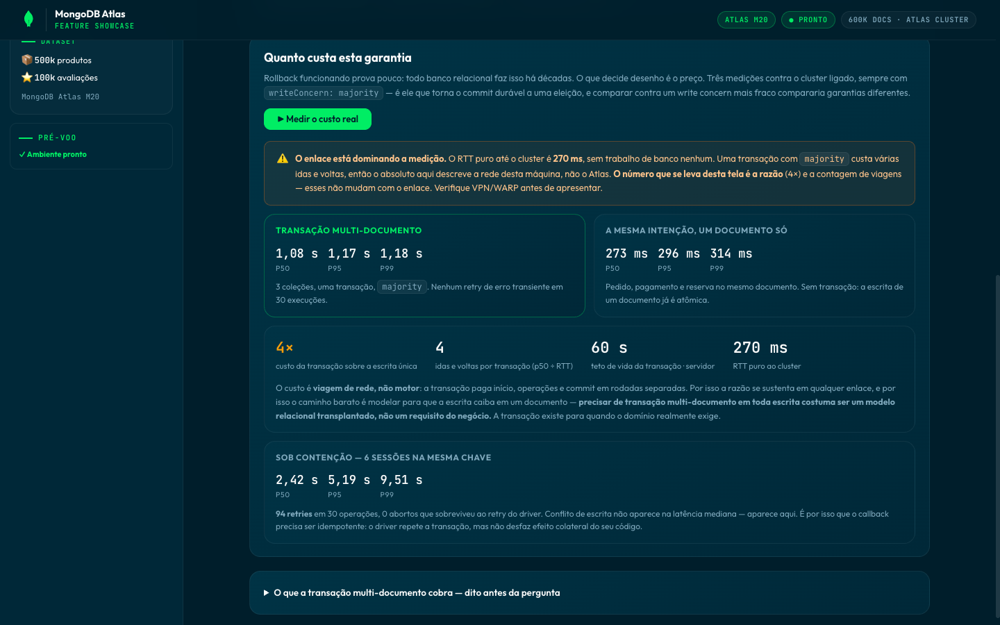
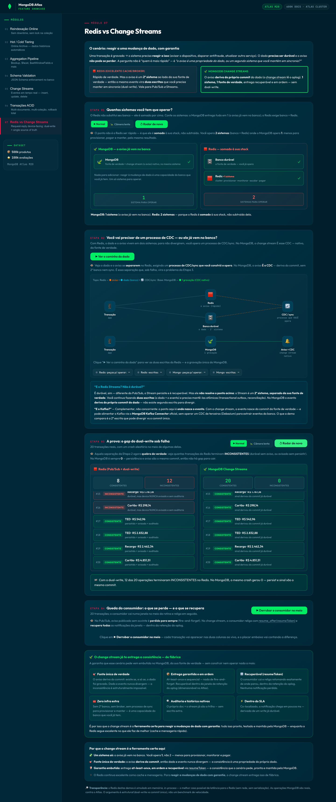

# MongoDB Atlas Feature Showcase

An interactive demo application that exercises seven core MongoDB Atlas capabilities
against a live cluster. Built with FastAPI and React 18.

> The application UI is in Portuguese (pt-BR).



## Features

| Module | Description |
|---|---|
| Online Reindexing | Rolling index builds with no downtime and no collection locks |
| Hot / Cold Tiering | Online Archive for automatic tiering of historical data through the Atlas Admin API |
| Aggregation Pipeline | `$lookup` with sub-pipeline, `$facet`, `$unionWith`, `$setWindowFields`, `$bucketAuto` |
| Schema Validation | JSON Schema enforcement at the database layer (enum, regex, ranges, required fields) |
| Change Streams | Real-time event feed (insert, update, delete) with `fullDocumentBeforeChange` and resume tokens |
| ACID Transactions | Multi-document, multi-collection transactions (`with_transaction` callback API) with step-by-step visualization and a rollback demo |
| Redis vs Change Streams | Dual-write vs single source of truth — live side-by-side proof of consistency under crashes and consumer recovery via resume token |

Every module is deep-linkable through the URL hash (`/#agg`, `/#streams`, `/#tx`, and so on).

## Screenshots

| Hot / Cold Tiering | Aggregation Pipeline |
|---|---|
|  |  |

| Schema Validation | Change Streams |
|---|---|
|  |  |

| ACID Transactions | Redis vs Change Streams |
|---|---|
|  |  |

## Stack

- Backend: Python 3.11, FastAPI, PyMongo, Uvicorn
- Frontend: React 18, Vite, plain CSS
- Database: MongoDB Atlas (M20), with `produtos` and `avaliacoes` collections

## Getting Started

### Prerequisites

- Python 3.11+
- Node.js 18+
- A MongoDB Atlas cluster (transactions and change streams work on any replica set, including free/Flex tiers; Online Archive requires M10+)

### 1. Clone

```bash
git clone https://github.com/adrianofratelli-glitch/mongodb-atlas-feature-showcase.git
cd mongodb-atlas-feature-showcase
```

### 2. Backend

```bash
cd backend
python -m venv venv
source venv/bin/activate        # Windows: venv\Scripts\activate
pip install -r requirements.txt
```

Copy the environment template and fill in your own values:

```bash
cp .env.example .env
```

```env
MONGO_URI=mongodb+srv://<user>:<password>@<cluster>.mongodb.net/
MONGO_DB=POC
ATLAS_PUBLIC_KEY=your_atlas_public_key
ATLAS_PRIVATE_KEY=your_atlas_private_key
ATLAS_PROJECT_ID=your_atlas_project_id
ATLAS_CLUSTER=your_cluster_name
```

Seed the database with synthetic data (required on a fresh cluster):

```bash
python seed_data.py            # 100k products + 20k reviews, enough for every module
python seed_data.py --full     # 5M products + 1M reviews, full-scale dataset
```

Start the API:

```bash
uvicorn main:app --reload --port 8002
```

Before presenting, verify that MongoDB, the required collections, and the
mutation guard are ready:

```bash
curl http://localhost:8002/preflight
```

### 3. Frontend

```bash
cd frontend
npm install
npm run dev
```

Open http://localhost:5174.

Or start both processes with readiness checks:

```bash
./start.sh --foreground
```

## Security model

The application contains intentionally destructive demonstrations (index and
collection removal, schema changes, and Online Archive administration). The
default local setup therefore:

- binds the launcher to `127.0.0.1`;
- accepts browser mutations only from the configured local origins;
- rejects remote mutations unless `DEMO_ADMIN_TOKEN` is configured;
- limits request bodies and validates user-controlled query parameters;
- returns request IDs instead of exposing internal exception details.

For a shared network, set a long random `DEMO_ADMIN_TOKEN` in `backend/.env`
and the same value as `VITE_DEMO_API_TOKEN` in `frontend/.env`. This protects
the PoV control surface but is not a replacement for production user
authentication or a reverse proxy.

## Dataset

The demos run against two collections, both generated by `backend/seed_data.py`:

| Collection | Documents (full) | Description |
|---|---|---|
| `produtos` | ~5,000,000 | E-commerce products: price, category, stock, ratings |
| `avaliacoes` | ~1,000,000 | Product reviews linked by `produto_id` |

The seed script also creates the indexes the demos depend on. The default run
(100k/20k) takes a couple of minutes and is enough to exercise every module.
Use `--full` to reproduce the large-scale dataset.

## Project Structure

```
.
├── backend/
│   ├── main.py                  # FastAPI app and CORS
│   ├── database.py              # MongoClient, timeouts and readiness
│   ├── security.py              # Mutation guard and defensive headers
│   ├── settings.py              # Centralized environment configuration
│   ├── requirements.txt
│   ├── .env.example             # Environment template (copy to .env)
│   └── routers/
│       ├── reindexacao.py       # Online index management
│       ├── hot_cold.py          # Online Archive (Atlas Admin API)
│       ├── aggregations.py      # Aggregation pipeline demos
│       ├── schema_validation.py # JSON Schema collMod demo
│       ├── change_streams.py    # Change stream watcher
│       ├── transactions.py      # ACID multi-document transactions
│       └── redis_vs_changestream.py
└── frontend/
    ├── src/
    │   ├── App.jsx              # Shell, sidebar, navigation
    │   ├── index.css            # Design tokens and base styles
    │   ├── hooks/useApi.js      # Fetch wrapper
    │   └── pages/               # One component per module
    └── vite.config.js
```

## Live Monitor (optional)

`live_monitor.py` is a terminal monitor that prints live read and write latency
against the cluster. It is useful during a demo to show that the cluster stays
fully available while an index builds.

```bash
python live_monitor.py
```

## Notes

- Change Streams require a replica set or sharded cluster (every Atlas cluster qualifies, including free/Flex tiers).
- ACID Transactions require MongoDB 4.0 or later on a replica set.
- Online Archive (Hot/Cold Tiering) requires a dedicated cluster (M10+).
- The Hot/Cold Tiering module calls the Atlas Admin API, so `ATLAS_PUBLIC_KEY`,
  `ATLAS_PRIVATE_KEY`, `ATLAS_PROJECT_ID`, and `ATLAS_CLUSTER` must be set.
- `backend/.env` is gitignored. Never commit real credentials.
- Run `pip install -r backend/requirements-dev.txt && pytest` for backend tests.
- GitHub Actions builds both applications, runs tests/lint, and audits dependencies.

## License

MIT
