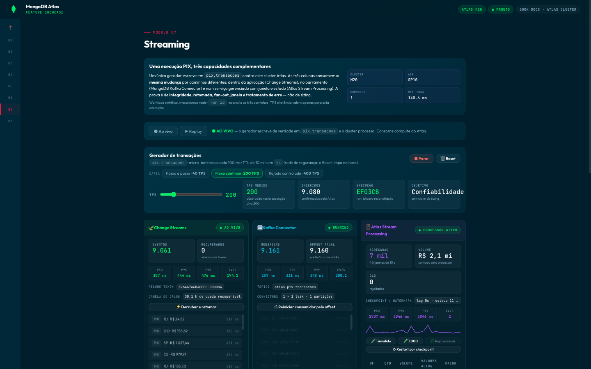
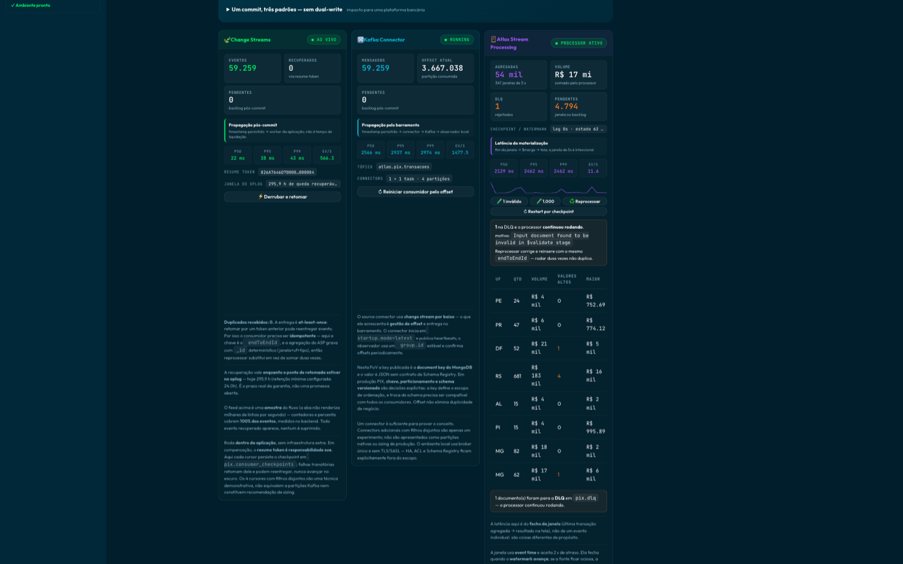
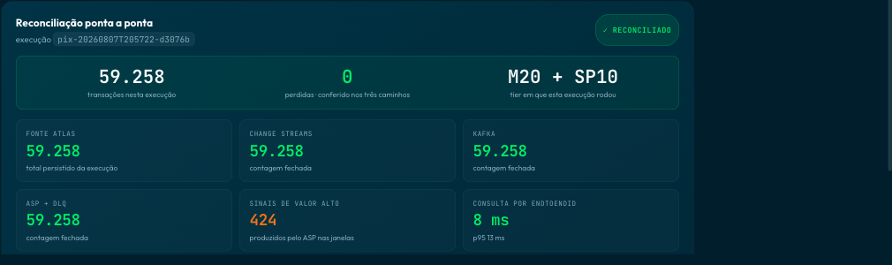
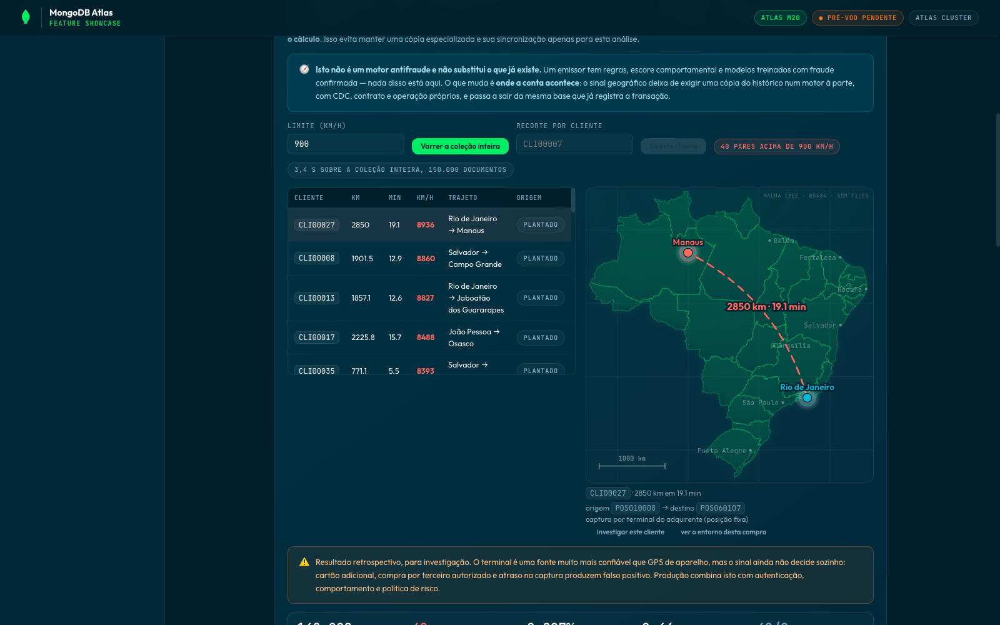
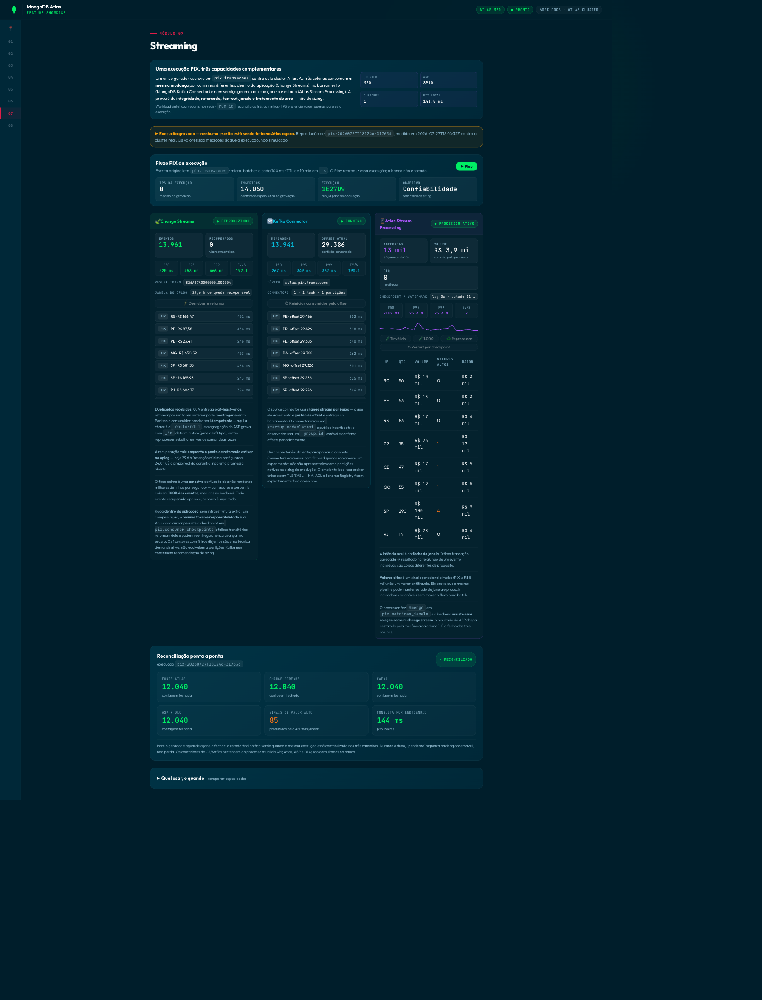

# MongoDB Atlas Feature Showcase

Eight MongoDB Atlas capabilities, each with a page you can click through while
they run against a real cluster. Build an index and watch reads keep flowing.
Break a change stream and watch it resume from its token. Roll back a
transaction and see the documents go back to where they were.

Nothing here invents results. All eight modules can talk to Atlas directly.
Streaming defaults to a live run and keeps a clearly labelled recording as an
operational fallback. If something is not configured the UI says so instead of
fabricating a number.

Built with FastAPI and React 18. The UI is in Portuguese (pt-BR).


## Features

| Module | What MongoDB does here |
|---|---|
| Online Reindexing | Builds indexes as a rolling operation — no downtime, no collection lock. `live_monitor.py` keeps printing read and write latency while it happens. |
| Hot / Cold Tiering | Online Archive moves aged documents to cheaper storage and keeps querying them through a single federated namespace. Driven by the Atlas Admin API. |
| Aggregation Pipeline | One query language for joins and analytics: `$lookup` with a sub-pipeline, `$facet`, `$unionWith`, `$setWindowFields`, `$bucketAuto`. |
| Schema Validation | JSON Schema enforced by the database itself — enums, regex, ranges, required fields — so a bad document is rejected at the source, not by application code. |
| Change Streams | An ordered feed of inserts, updates and deletes. Module 05 shows pre/post-images; module 07 proves durable resume tokens, re-delivery and idempotency inside the oplog window. |
| ACID Transactions | Multi-document, multi-collection transactions through the `with_transaction` callback API, stepped through on screen, including a rollback. |
| Streaming | Three ways to react to a change, side by side on the same writes: Change Streams, the MongoDB Kafka Connector, and Atlas Stream Processing doing windowed aggregation in the cloud. |
| Geographic risk | Card-present terminal locations, a retrospective impossible-travel risk signal with `$setWindowFields` + haversine in pure MQL, and one `$search` combining merchant text relevance, a geo filter and facets. The index-plan comparison remains available as technical evidence. |

Every module is deep-linkable through the URL hash (`/#agg`, `/#streams`, `/#tx`, and so on).

For the current implementation decisions, trade-offs and validation baseline,
see [`docs/SESSION_HANDOFF.md`](docs/SESSION_HANDOFF.md).

The presenter-only Streaming talk track is maintained separately in
[`docs/roteiro-apresentacao-streaming.md`](docs/roteiro-apresentacao-streaming.md).

The current demo cluster and Atlas Stream Processing workspace are colocated in
AWS `sa-east-1` (São Paulo). Keep them together and verify that the presenting
laptop is not egressing through a US VPN or Cloudflare/WARP route before using
latency figures. The measured region move reduced pure RTT from 148.10 ms to
7.39 ms and one-PIX client round-trip from 141.70 ms to 11.54 ms.

## The Streaming module

A question that comes up a lot: if something changes in MongoDB, how does the
rest of my system hear about it? There is more than one answer, so this module
runs several of them at once, on the same writes.

In live mode, one generator writes payment events into `pix.transacoes`. Four
consumers read those same writes simultaneously: Change Streams inside the app,
the MongoDB Kafka Connector publishing to a real broker, an Atlas Stream
Processing job aggregating 5-second windows in the cloud and merging them back
into a collection, and a second stream processor that computes a geographic risk
signal — the one module 08 opens with.

The stream carries two channels. `PIX` has no coordinate, because a PIX transfer
genuinely does not carry one. `CARTAO_PRESENCIAL` does: a card-present purchase
is captured at an acquirer terminal, whose position is registered data and not
the customer's phone GPS. That is what makes a geographic signal defensible, and
it is why the two channels share one stream instead of one demo each.

The default write path models one acknowledged `insert_one` per PIX. It offers 1,000 TPS as the customer's
reference mark and 2,000 TPS as the sustained stage target; batch mode remains
available for the higher-volume story. These are measured comparison points,
not certified capacity or production sizing.

The transactions are synthetic. Everything else — Atlas, the Kafka broker, the
checkpoints, the dead-letter queue — is real, and if a piece is not configured
its column says so while the other two keep going.



### The three columns

Same data, three routes out of it. Each column reports its own events per second
and p50/p95/p99 latency, plus the state of the thing actually doing the work.



The recorded run includes a controlled 3-second cursor interruption while writes
continued, followed by recovery from the persisted resume token. Events from the
gap arrive marked as recovered and reconciliation accounts for the finite run.
The action button stays disabled during replay because there is no live cursor to
kill. Beside it sits the oplog window: recovery is bounded by that retention,
not an open-ended guarantee.

### Break it on purpose

A run where nothing goes wrong does not prove recovery — it proves nothing went
wrong. Two buttons sit next to the generator for exactly that reason.

**Drop the Kafka Connector** stops the connector mid-flow and brings it back
eight seconds later. Stopping does not discard the offset: the resume token
stays in `connect-offsets`, so everything written to Atlas during the outage is
delivered afterwards. **Inject an invalid event** writes a transaction whose
`valor` is a string. It is a perfectly good document as far as the collection is
concerned, so it counts at the source, but the stream processor's `$validate`
diverts it to the dead-letter queue and keeps running.

Then you watch reconciliation close anyway. That is the moment worth having on
stage.

### Did anything get lost?

Each generator run gets a `run_id`, which makes the run countable. The panel
compares that one run across the source collection, Change Streams, Kafka, and
Atlas Stream Processing plus its DLQ. The four numbers agree only after every
path accounts for the run. With event-time windows, stopping the source does not
force the final window closed: a later event must advance the watermark.

Delivery is at-least-once, and the page says so above the numbers rather than in
a footnote. After a resume, the same event can arrive again; the unique index on
`endToEndId` is what makes reprocessing safe, and it is why the count reads zero
duplicates. Ordering is guaranteed inside a partition — `particao`, derived from
the payer — not across partitions. For anyone who works on payments, that
sentence matters more than any throughput number on the screen.



The run above had both failures injected halfway through: 59,258 transactions,
the same count on all four paths, zero duplicates, and one document parked in
the DLQ.

## Screenshots

| Hot / Cold Tiering | Aggregation Pipeline |
|---|---|
|  |  |

| Schema Validation | Change Streams |
|---|---|
|  |  |

| ACID Transactions | Geo |
|---|---|
|  |  |

The Geo shot is a live run. The map is inline SVG with a hand-written
projection: no Leaflet, no tiles, no request at runtime, so the module keeps
working with the venue's network down. In the same run the explain comparison
read 3 index keys against 49,493 for the same `$geoWithin` — the compound index
finishing in 3 ms where the plain `2dsphere` took 234 ms.

## Stack

- Backend: Python 3.11, FastAPI, PyMongo, Uvicorn
- Frontend: React 18, Vite, plain CSS
- Database: MongoDB Atlas, with `produtos` and `avaliacoes` collections
- Optional for the Streaming module: Kafka (local, via Homebrew or Docker) and an
  Atlas Stream Processing instance

## Getting Started

### Prerequisites

- Python 3.11+
- Node.js 18+
- A MongoDB Atlas cluster (transactions and change streams work on any replica set, including free/Flex tiers; Online Archive requires M10+)

### 1. Clone

```bash
git clone https://github.com/adrianofratelli-glitch/mongodb-atlas-feature-showcase.git
cd mongodb-atlas-feature-showcase
```

### Quick start, once configured

After the setup below has been done once, a whole demo environment is one
command. Run `./scripts/prepare-demo.sh` ahead of the presentation to materialize
Geo and Atlas Search. `bin/overview` only performs a fast read-only preflight,
removes scoped PIX residue, starts the backend/frontend and opens the browser.
It never pauses, resumes or resizes the Atlas cluster. Kafka and Atlas Stream
Processing start by default for the live Streaming page; use `--replay` for the
no-write fallback:

```bash
./bin/overview          # up
./bin/overview --replay # backend/frontend + recorded fallback, no ASP/Kafka
./bin/overview down     # stop app/ASP/Kafka and clean PIX; cluster untouched
./bin/overview status
./bin/overview logs     # tail the backend log
```

Symlink it for a one-word command: `ln -sf "$(pwd)/bin/overview" /opt/homebrew/bin/overview`.

**Run `overview down` when you are finished.** It stops the generator and ASP
before removing `pix.transacoes`, windows, DLQ, audit, application checkpoints,
the connector, the demo Kafka topic and its consumer group. It stops Kafka but
does not alter the cluster. A running stream processor bills per second whether or
not anyone is watching. The cloud half is
`scripts/ambiente.sh {up,down,status}`, which reads credentials from
`backend/.env` and can be called on its own.

### 2. Backend

```bash
cd backend
python -m venv venv
source venv/bin/activate        # Windows: venv\Scripts\activate
pip install -r requirements.txt
```

Copy the environment template and fill in your own values:

```bash
cp .env.example .env
```

```env
MONGO_URI=mongodb+srv://<user>:<password>@<cluster>.mongodb.net/
MONGO_DB=POC
ATLAS_PUBLIC_KEY=your_atlas_public_key
ATLAS_PRIVATE_KEY=your_atlas_private_key
ATLAS_PROJECT_ID=your_atlas_project_id
ATLAS_CLUSTER=your_cluster_name
```

Seed the database with synthetic data (required on a fresh cluster):

```bash
python seed_data.py            # 100k products + 20k reviews, enough for every module
python seed_data.py --full     # 5M products + 1M reviews, full-scale dataset
```

Start the API:

```bash
uvicorn main:app --reload --port 8002
```

Before presenting, verify that MongoDB, the required collections, and the
mutation guard are ready:

```bash
curl http://localhost:8002/preflight
```

### 3. Frontend

```bash
cd frontend
npm install
npm run dev
```

Open http://localhost:5174.

Or start both processes with readiness checks, without touching the cloud
environment:

```bash
./start.sh --foreground
```

## Streaming — setup

The Streaming module (`/#streaming`) shows the three ways to react to a change
in Atlas side by side against a live run. The setup below is required once for
the default demo. The recorded fallback remains available with
`overview --replay`.

**1. Start Kafka locally.** Two ways to do it, pick one.

*Native (no Docker required, recommended on a laptop):*

```bash
brew install kafka          # once
./scripts/kafka-local.sh up # broker (KRaft) + Kafka Connect + MongoDB plugin
./scripts/kafka-local.sh status
./scripts/kafka-local.sh down
```

*Docker:*

```bash
docker compose -f docker-compose.streaming.yml up -d
```

Either way the `mongodb-kafka-connect` plugin is downloaded on the first run
only and cached locally, so later runs work offline. The native path uses
`localhost:9092` and the Docker path uses `localhost:19092`, so set
`KAFKA_BROKERS` in `backend/.env` accordingly.

**2. Register the source connectors** (reads `MONGO_URI` from `backend/.env`):

```bash
./scripts/setup-kafka-connector.sh      # one connector (default)
./scripts/setup-kafka-connector.sh 2    # optional experiment with disjoint filters
```

It PUTs a `MongoSourceConnector` config on the Connect REST API
(`http://localhost:8083`) with `database=pix`, `collection=transacoes`,
`publish.full.document.only=true`, `startup.mode=latest`, heartbeats and
`topic.prefix=atlas`, producing the topic `atlas.pix.transacoes`.
On the Docker path a console at http://localhost:8085 lets you inspect the topic
live; the native path has no UI, so use `./scripts/kafka-local.sh status`.

Before registering, the script stops each stale connector, deletes its offsets
and only then deletes the connector. Deleting a connector does **not** delete
its offsets — Connect keeps the resume token in `connect-offsets` keyed by
connector name, and `startup.mode=latest` applies only when no offset is stored.
Because `overview up` drops `pix.transacoes`, that stored token points at an
oplog position that no longer exists, and the task fails with
`ChangeStreamHistoryLost` while the connector still reports `RUNNING`. If you
ever see `RUNNING · FAILED`, that is the cause; the offsets endpoint needs
Kafka Connect 3.6+.

**3. Create the Stream Processing Instance** (Atlas UI → Stream Processing):
create an SPI in the same region as the cluster. The processor reads the
cluster's change stream, so keeping them together saves a cross-region hop on
every window. Add an *Atlas Database* connection named `atlasCluster`, then:

```bash
# in backend/.env: ASP_ENABLED=true and ASP_CONNECTION_STRING=<SPI connection string>
mongosh "$ASP_CONNECTION_STRING" --file scripts/setup-asp.js
mongosh "$ASP_CONNECTION_STRING" --file scripts/setup-asp-geo.js
```

There are two processors because a deployed pipeline has exactly one terminal
sink. `pixJanelas5s` ends in `pix.metricas_janela`; `geoSinais30s` ends in
`geo.sinais_ao_vivo`. They are two independent consumers of the same change
stream, which happens to be the module's own argument. `scripts/ambiente.sh`
provisions and stops both.

The script preserves an existing processor and its checkpoint by default. To
replace the definition intentionally, run it once with `ASP_RECREATE=true`;
that destructive choice is printed explicitly.

The processor reads the change stream of `pix.transacoes`, sends malformed
documents to a DLQ, aggregates 5-second event-time windows by `run_id`, `uf`
and `tipo` (count, volume, ticket and a simple high-value signal), and `$merge`s each closed window into
`pix.metricas_janela`. The backend surfaces those windows by watching that
collection with a change stream, so the stream processing result reaches the
screen through the same mechanism as column 1.

Tear everything down with `./scripts/teardown-streaming.sh` (add `--volumes` to
drop the cached plugin).

**Cleaning up between runs.** `POST /streaming/reset` (the **Reset** button)
clears the current source, windows, DLQ and audit while keeping the environment
ready for another run. `POST /streaming/reset?finalizar=true`, used by
`overview down`, first stops the processor and also removes application
checkpoints. `scripts/ambiente.sh down` performs a second direct, scoped cleanup
before stopping the local integration services, so an interrupted API call does
not leave demo data behind. It never pauses or resizes the Atlas cluster.

Reset preserves the three source contracts: unique `endToEndId`, TTL on `ts`
and `run_id_reconciliacao`. It reuses the application's connected MongoDB
topology and clears independent collections concurrently. Above
`STREAMING_DROP_ACIMA_DE` (25,000 documents by default), it uses a controlled
drop/recreate and then recovers ASP/Kafka instead of spending the stage pause on
`delete_many`; measured preparation was 6.43 s after a 59k-document run and
1.33 s on an initially clean run. A routine cleanup does not restart Kafka.

The 5-minute TTL index on `ts` (`STREAMING_TTL_SEGUNDOS`) is the safety net for
when you forget to reset, not the main mechanism. In steady state the TTL
deleter removes at the same rate you insert, whatever the window; what the
window actually decides is the size of the **live set**. At 1800 s the
collection settled near a million documents — data plus indexes larger than an
M20's WiredTiger cache, which on its own sustained the memory pressure that
triggers auto-scaling. A 60-second TTL was deliberately rejected for the stage
run: after the first minute it would delete at roughly the ingest rate, add
oplog pressure and could remove source documents before reconciliation. The
30-second finite run plus **Reset** is the cleanup path; 300 seconds is only the
fallback window.

**The Streaming page defaults to live.** It opens the three observer paths only
when the operator starts a session, measures the requested and achieved TPS,
and stops Atlas-facing polling once a finite run reconciles. The alternate
**Replay de segurança** mode reads `backend/data/replay_streaming.json` through
`/replay/*`; it never writes to MongoDB and remains permanently labelled.

The shell's normal state is green `Pronto`. `Pré-voo pendente` means an actual
required check failed; it replaced the ambiguous `Verificar` badge. The
presenter-oriented React/Distribute/Transform decision panel was intentionally
removed from the customer screen and moved to the presentation guide linked at
the top of this README.

The window moved from 10 s to 5 s. The semantics are unchanged — tumbling, no
overlap — but at 10 s column 3 went mute for ten seconds at a time, and an
audience watching twenty seconds of the demo saw at most two bursts. The
recording also keeps rolling for 25 s after the run reconciles: stopping at the
moment of reconciliation left the final green state alive for only the last few
seconds of a ~106 s loop, so the payoff vanished into the rewind.

The live page keeps the earlier relative-CPU lesson: do not leave it observing
after the run, and always finish with `overview down`.

**Open the live capture page before starting the generator.** The Change Stream
and Kafka consumers start lazily on the first SSE subscription. The observer
uses `auto.offset.reset=earliest`, while the source connector itself uses
`startup.mode=latest` when it has no stored offset. Waiting for the Kafka column
to report `consumindo` before writing keeps the capture boundary explicit and
avoids measuring consumer startup as backlog.



The on-screen origin badge is permanent and names the recorded `run_id` and
timestamp. The generator card also says that playback does not touch the
database, and a separate warning appears when the recording file is absent. The
figures are real measurements, not a live execution. In the shot the four paths
agree at 12,200 with zero observed duplicates and an empty DLQ.

Actions that would act on a real environment (connector restart, DLQ injection,
checkpoint restart) stay visible but disabled — the capability is part of the
story, but there is nothing to act on during a replay.

**ASP and Kafka are provisioned by default for the live page.** `overview`
verifies the materialized assets, starts ASP/Kafka/backend/frontend and does not
resize the cluster. The processor bills per second, so `overview down` is part
of the demo runbook. To capture or refresh the fallback recording:

```bash
overview                      # preflight + ASP + Kafka + backend + frontend
python scripts/capture_replay.py
```

Record a run with the environment up:

```bash
python scripts/capture_replay.py                    # 60 s of real writes at 200 TPS
python scripts/capture_replay.py --segundos 90 --tps 200
```

The capture subscribes to the same SSE streams and polls the same endpoints the
page consumes live, storing each payload with its timestamp. **The replayed
numbers are measurements, not simulation** — the recorder does not synthesise
anything. Because that distinction only holds if the audience can see it, the
page shows a permanent badge naming the recorded `run_id` and its date, every
replay payload carries `replay: true`, and actions that act on the real
environment (connector restart, DLQ injection and checkpoint restart) are
disabled. Do not present a replay as a live run.

Why it exists: M20/M30 are burstable instances, and Atlas compute auto-scaling
fires on **relative** CPU (`NORMALIZED_AUTO_SCALE_SYSTEM_CPU > 0.75`), not
absolute. Measured on this project, 17.6% absolute CPU registered as 88%
relative and scaled the cluster to M30 — with the generator already stopped, on
dashboard polling alone. Replay removes that cost entirely for the parts of the
demo that only need to show the mechanics.

**Stage calibration.** The live path is calibrated for a finite 30-second run;
it is not a production benchmark or a sustained-capacity statement:

- `run_id` is indexed. The reconciliation panel counts the source every few
  seconds; without that index the count is a full collection scan repeated in a
  loop, and it was by far the largest consumer of cluster CPU and cache.
- The reconciliation poll runs every 5 s and **stops** once the run is final —
  it no longer re-queries Atlas for an answer that cannot change.
- **Play** defaults to individual mode at 2,000 TPS for 30 seconds. The async
  driver issues one acknowledged `insert_one` per PIX, which matches the bank
  path and makes ACK latency interpretable per transaction. At 2,000 TPS the
  measured run delivered 2,037 TPS with Atlas p50 3.07 ms, client ACK p50
  17.6 ms, Change Streams p50 21.9 ms and Kafka p50 32.1 ms.
- Batch mode remains available for the volume story. The generator ceiling is
  15,000 TPS and four disjoint Change Stream observers expose consumer
  headroom; neither is a production capacity claim. The full 4k→12k batch ramp
  reconciled on M20 + **SP10** with DLQ 0; the local Kafka observer degraded
  before Atlas Stream Processing.
- The 2026-08-07 live acceptance run produced 59,896 documents and reconciled
  Atlas, Change Streams, Kafka and ASP/DLQ with zero loss. Final state arrived
  in 41.09 s including the 30-second generation window.
- `/preflight`'s `cluster_tier` check now **passes** on the entry tier and fails
  when the cluster has scaled above it. It previously did the opposite: it
  failed on M20 and told the operator to run load until the cluster scaled up,
  which encoded "scale up before demoing" as a prerequisite.
- Cluster state and tier are operator-owned. `overview` reports application
  readiness but never pauses, resumes, resizes or changes auto-scaling.

Two Atlas rules are worth knowing before touching this, because both fail with
HTTP 400: compute auto-scaling requires `minInstanceSize` **strictly** less than
`maxInstanceSize` — so "pin the cluster to M20 while keeping auto-scaling on" is
not expressible — and every tier has a maximum disk size, so a 150 GB cluster
cannot take an M10 floor (M10 tops out at 128 GB).

Relevant environment variables: `STREAMING_DB`, `KAFKA_BROKERS`, `CONNECT_URL`,
`CONNECT_CONNECTOR_NAME`, `ASP_ENABLED`, `ASP_CONNECTION_STRING`,
`ASP_CONNECTION_NAME`, `ASP_PROCESSOR_NAME`, `ASP_GEO_PROCESSOR_NAME`
(`geoSinais30s`), `ASP_TIER` (stage default `SP10`),
`STREAMING_CARTAO_PCT` (18 — share of the stream on the card channel; at 0 the
stream is PIX-only and module 08's event-time panel stays empty),
`STREAMING_SINAL_KMH` (900), `STREAMING_SINAL_MIN_KM` (200),
`STREAMING_SINAL_MIN_MIN` (1),
`STREAMING_MODO_ESCRITA` (`individual`), `STREAMING_DEMO_TPS_INDIVIDUAL`
(2,000), `STREAMING_DEMO_TPS` (8,000 for batch mode),
`STREAMING_CS_PARTICOES` (default 4), `STREAMING_TTL_SEGUNDOS` (default 300),
`STREAMING_DROP_ACIMA_DE` (default 25,000), `STREAMING_DEMO_DURATION_S` (30),
`STREAMING_CONCEPT_TPS` (200; API ceiling 15,000),
`ATLAS_TIER_INICIAL` (preflight expectation only), `ATLAS_MIN_TIER`
(documentation only) and `KAFKA_CONSUMER_GROUP`.

### Transaction values

Real payment traffic is lopsided: lots of small transfers and a few big ones that
carry most of the money. Drawing values uniformly loses that, and the average
ticket comes out wrong. `PERFIS_VALORES` declares weighted value bands per
transaction type instead. Pick one with `STREAMING_PERFIL_VALORES`:

| Profile | Median | Mean | Mean ÷ median | Top 1% of volume |
|---|---|---|---|---|
| `varejo` (default) | R$ 91 | R$ 559 | 6.2× | 36% |
| `corpo_medio` | R$ 500 | R$ 1,252 | 2.5× | 18% |

Both keep the long tail. We tried a flat draw between R$ 100 and R$ 2,000: the
mean lands almost on the median (1.4×) and the top 1% ends up carrying 3% of the
volume, which is not what a payments flow looks like.

`GET /streaming/perfil-valores` returns the declared bands next to percentiles
measured with `$percentile` on the live collection — a nice way to see an
aggregation operator answer a question about data that is being written as you
ask.

### Reading the numbers

The throughput and latency on screen describe this run, on this cluster, from
wherever you are sitting. They are not a capacity figure for MongoDB, and the
default presets stay modest on purpose so the whole thing runs on a small,
cheap tier.

Two things worth knowing before you read a latency number:

- It includes the round trip to the cluster, printed above the columns. Running
  from Brazil against a US cluster adds roughly 200 ms of pure distance to
  everything.
- The per-event feeds redraw once every 120 ms, because no browser tab draws
  thousands of rows per second. The counters and percentiles behind them still
  count every single event.

The number to actually trust is the reconciliation described above. Throughput
varies with your laptop, your region and your tier; whether the events all
arrived does not.

## Geo — setup

The Geo module runs against its own database (`geo`, override with `GEO_DB`), so
it never touches the `POC` or `pix` collections. Materialize it before the demo;
`overview` only runs the fast, read-only check:

```bash
./scripts/prepare-demo.sh             # run ahead of the presentation
python scripts/seed_geo.py            # 2,000 clients × 75 transactions = 150k docs
python scripts/seed_geo.py --drop     # recreate from scratch
python scripts/seed_geo.py --ensure   # keep if current; recreate if stale/incomplete
./scripts/create_search_index_geo.sh  # create/update and wait until READY
```

The generator is seeded with a fixed value and carries a dataset version, so every `endToEndId` is stable and
the unique index rejects re-inserts: running the seed twice leaves 150k
documents, not 300k. Points are gaussian clusters around 40 real Brazilian
municipalities weighted by population — uniformly random coordinates inside the
country's bounding box look obviously fake on a projector.

Location is never presented as a PIX field. Every point in this dataset is a
card-present purchase, and its coordinate belongs to the acquirer's terminal —
registered data, not the customer's phone. That distinction is the whole
argument: a terminal's position is not controlled by whoever is paying, though
it can still be stale or wrong in the registry. Provenance travels with the
point (terminal id, channel, source, quality) so the signal never looks like a
fact without an origin.

Forty clients get a deliberately impossible pair: two transactions roughly five
minutes and 700+ km apart. Their IDs are written to
`backend/data/fraud_seeds.json` so the impossible-travel panel has a guaranteed
result on stage.

### The signal in event time

The panel that opens the module does not scan history at all. It reads
`geo.sinais_ao_vivo`, which the `geoSinais30s` stream processor fills while
module 07 is running: it groups the card channel by cardholder in a 30-second
hopping window and runs haversine in MQL right there, inside the window.


Two counters, deliberately kept apart. The generator injects a pair every six
seconds so the stage always has something to show — those are the *planted*
ones. Anything else came out of ordinary traffic and was found by the pipeline,
not arranged for it. Presenting one total would turn the guarantee into the
evidence, which it is not.

A speed threshold on its own is a false-positive machine: two purchases 20 km
apart captured seconds apart read as 1,343 km/h. The signal therefore needs
three conditions — km/h above the limit, at least 200 km of distance, and at
least a minute between the two captures. Below those, "speed" is simultaneous
capture, not travel.

Note the two timestamps in the card channel: `ts` is when the event entered the
stream (also the TTL field), while `compradaEm` is when the purchase happened at
the terminal, which can be minutes earlier because acquirer capture lags. The
speed is computed from `compradaEm`. Putting that back-dated instant into `ts`
made the TTL delete the older half of a pair before reconciliation ran, and the
source then counted fewer than the consumers — expiry that looks exactly like
loss.
The result is explicitly a retrospective risk signal, not a fraud decision or
an inline payment-blocking control. Production still needs provenance validation,
anti-spoofing, multiple-device handling, LGPD controls and policy calibration.

Indexes created by the seed:

| Index | Used by |
|---|---|
| `cliente_status_local_idx` — `{clienteId: 1, status: 1, local: "2dsphere"}` | Demo A, the compound plan |
| `local_2dsphere_idx` — `{local: "2dsphere"}` | Demo A, the geo-only plan it is compared against |
| `cliente_ts_idx` — `{clienteId: 1, ts: 1}` | Demo B, `$setWindowFields` partition + sort |
| `categoria_local_idx` — `{"estabelecimento.categoria": 1, local: "2dsphere"}` | category-scoped geo queries |
| `uf_ts_idx` — `{uf: 1, ts: -1}` | regional slicing |
| `e2e_unq_idx` — unique `{endToEndId: 1}` | seed idempotency |

### The Atlas Search index

Demo C needs one Atlas Search index. Create it with:

```bash
./scripts/create_search_index_geo.sh
```

Until it reports `READY`, the search panel renders a "não configurado" notice
rather than inventing results. The definition it applies:

```json
{
  "mappings": {
    "dynamic": false,
    "fields": {
      "estabelecimento": {
        "type": "document",
        "fields": {
          "nome": { "type": "string", "analyzer": "lucene.portuguese" },
          "categoria": [{ "type": "token" }, { "type": "stringFacet" }]
        }
      },
      "uf": [{ "type": "token" }, { "type": "stringFacet" }],
      "local": { "type": "geo" }
    }
  }
}
```

`categoria` and `uf` are indexed twice on purpose: `token` serves the exact
filter, `stringFacet` serves the `$searchMeta` facet.

### What the module does not claim

The page says this out loud, and so does this README: MongoDB answers
geospatial *predicates* — is this inside, does it cross, what is nearby. It has
no geometry algebra (no buffer, union, intersection or area), only WGS84 with
no reprojection, and no raster, topology or routing. `$geoNear` must be the
first pipeline stage, and `$vectorSearch`'s `filter` does not accept geospatial
operators at all. Workloads that require geometry construction, topology,
routing or heavy GIS analysis need a dedicated geospatial system.

## Security model

Some of these demos genuinely destroy things — they drop indexes, change
validation rules with `collMod`, and create and delete Online Archives. That is
the point, but it means the default setup keeps the blast radius local:

- binds the launcher to `127.0.0.1`;
- accepts browser mutations only from the configured local origins;
- rejects remote mutations unless `DEMO_ADMIN_TOKEN` is configured;
- limits request bodies and validates user-controlled query parameters;
- returns request IDs instead of exposing internal exception details.

For a shared network, set a long random `DEMO_ADMIN_TOKEN` in `backend/.env`
and the same value as `VITE_DEMO_API_TOKEN` in `frontend/.env`. This protects
the PoV control surface but is not a replacement for production user
authentication or a reverse proxy.

The bundled Kafka stack is a single-node local lab: no TLS, SASL, ACLs or Schema
Registry. It shows the connector working, nothing more. A real deployment needs
encrypted transport, authorization, HA brokers, secrets through a
ConfigProvider, and a schema-compatibility policy.

## Dataset

The demos run against two collections, both generated by `backend/seed_data.py`:

| Collection | Documents (full) | Description |
|---|---|---|
| `produtos` | ~5,000,000 | E-commerce products: price, category, stock, ratings |
| `avaliacoes` | ~1,000,000 | Product reviews linked by `produto_id` |

The seed script also creates the indexes the demos depend on. The default run
(100k/20k) takes a couple of minutes and is enough to exercise every module.
Use `--full` to reproduce the large-scale dataset.

## Project Structure

`ARCHITECTURE.md` has the full request-path diagram and a per-file
responsibility table. The short version:

```
.
├── bin/overview                 # One command: cloud env + backend + frontend
├── scripts/
│   ├── ambiente.sh              # preflight + ASP/Kafka; cluster untouched
│   ├── prepare-demo.sh          # materializes Geo/indexes before the demo
│   ├── cleanup-streaming-data.py # Scoped removal of collections generated by PIX
│   ├── kafka-local.sh           # Native Kafka (KRaft) + Connect + Mongo plugin
│   ├── setup-kafka-connector.sh # Registers the source connector
│   ├── setup-asp.js             # Creates the windowing stream processor (mongosh)
│   ├── setup-asp-geo.js         # Creates the geo-risk stream processor (mongosh)
│   ├── lib/expand_srv.py        # Rewrites the SRV URI so the connector skips DNS
│   ├── seed_geo.py              # Geo dataset: 150k georeferenced transactions
│   ├── create_search_index_geo.sh # Atlas Search index for the Geo module
│   ├── generate-streaming-guide.py # Regenerates the presenter PDF from Markdown
│   └── teardown-streaming.sh
├── docs/
│   ├── SESSION_HANDOFF.md        # Current decisions, evidence and operational state
│   ├── roteiro-apresentacao-streaming.md  # Editable presenter talk track
│   └── roteiro-apresentacao-streaming.pdf # Generated two-page presenter guide
├── backend/
│   ├── main.py                  # FastAPI app, CORS, health, /preflight, /stats
│   ├── database.py              # MongoClient, timeouts and readiness
│   ├── security.py              # Mutation guard and defensive headers
│   ├── settings.py              # Centralized environment configuration
│   ├── requirements.txt
│   ├── .env.example             # Environment template (copy to .env)
│   ├── routers/
│   │   ├── reindexacao.py       # Online index management
│   │   ├── hot_cold.py          # Online Archive (Atlas Admin API)
│   │   ├── aggregations.py      # Aggregation pipeline demos
│   │   ├── schema_validation.py # JSON Schema collMod demo
│   │   ├── change_streams.py    # Change stream watcher
│   │   ├── transactions.py      # ACID multi-document transactions
│   │   ├── streaming.py         # Generator + Change Streams / Kafka / ASP (SSE)
│   │   └── geo.py               # explain compare, impossible travel, geo + $search
│   ├── data/                    # uf-independent module data (fraud_seeds.json)
│   └── tests/                   # pytest; no live cluster required
├── frontend/
│   ├── src/
│   │   ├── App.jsx              # Shell, sidebar, hash routing
│   │   ├── index.css            # Design tokens and base styles
│   │   ├── hooks/useApi.js      # Fetch wrapper
│   │   ├── components/          # DemoFlow, QueryBlock
│   │   └── pages/               # One component per module
│   └── vite.config.js           # Proxies /api to :8002
├── docker-compose.streaming.yml # Redpanda + Connect + console (Docker path)
├── live_monitor.py              # Terminal latency monitor
└── docs/screenshots/
```

## Live Monitor (optional)

`live_monitor.py` prints read and write latency against the cluster, live, in a
terminal. Run it in a second window while the Online Reindexing module builds an
index: the latency line just keeps going, which is the whole claim about rolling
index builds, visible instead of asserted.

```bash
python live_monitor.py
```

## Notes

- Change Streams require a replica set or sharded cluster (every Atlas cluster qualifies, including free/Flex tiers).
- ACID Transactions require MongoDB 4.0 or later on a replica set.
- Online Archive (Hot/Cold Tiering) requires a dedicated cluster (M10+).
- The Hot/Cold Tiering module calls the Atlas Admin API, so `ATLAS_PUBLIC_KEY`,
  `ATLAS_PRIVATE_KEY`, `ATLAS_PROJECT_ID`, and `ATLAS_CLUSTER` must be set.
- Several endpoints are deliberately destructive. Point this at a disposable demo
  cluster only.
- `backend/.env` is gitignored. Never commit real credentials.
- Tests: `pip install -r backend/requirements-dev.txt && pytest` (127 tests, all
  unit — Mongo is stubbed, so no cluster is needed). Lint with `ruff check backend`.
- GitHub Actions builds both applications, runs tests/lint, and audits dependencies.

## License

MIT
