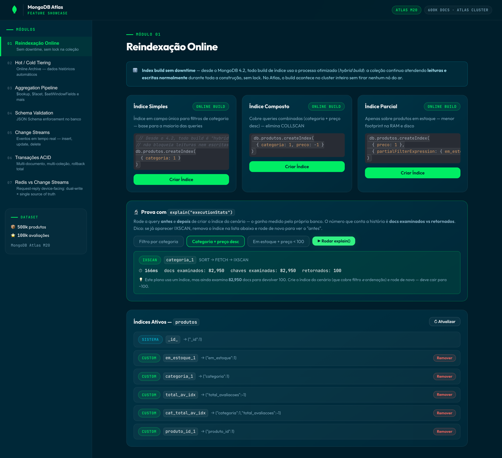
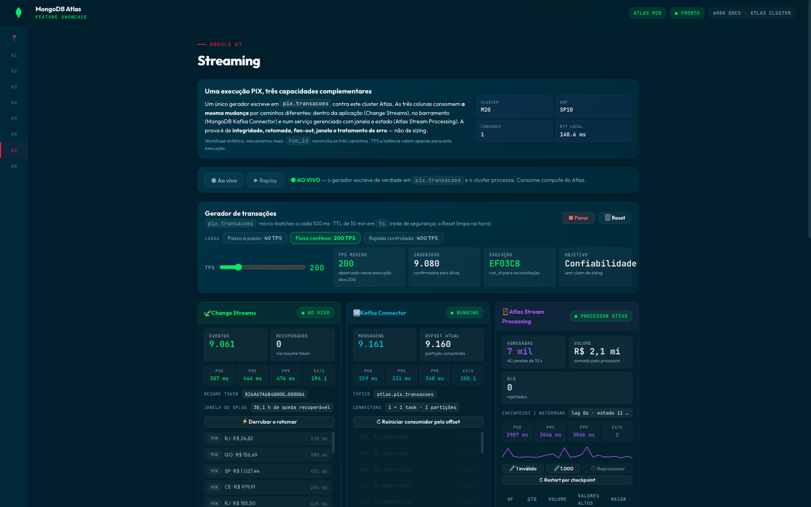
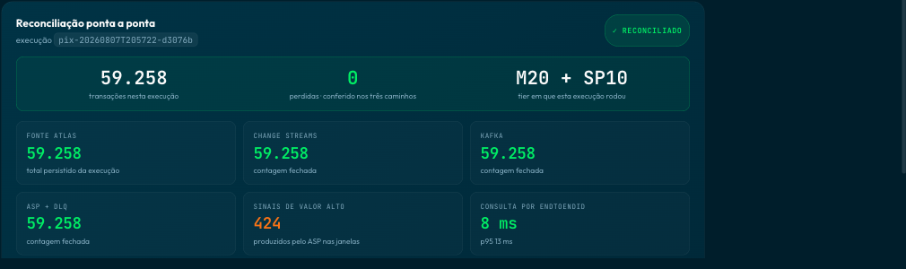
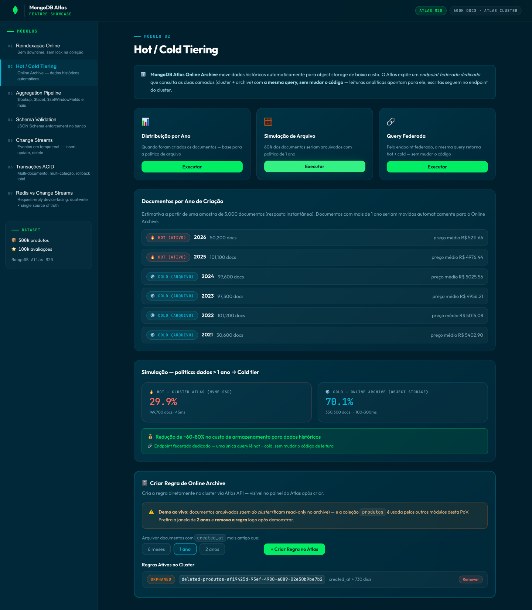
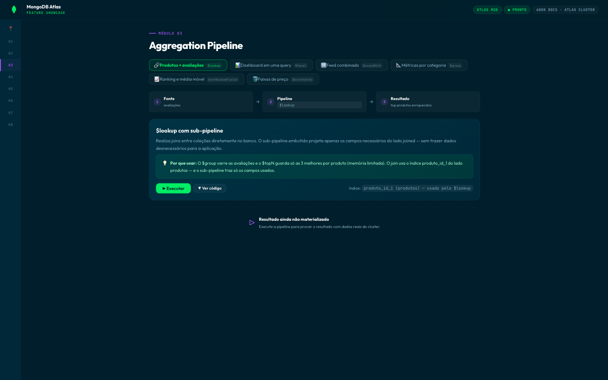
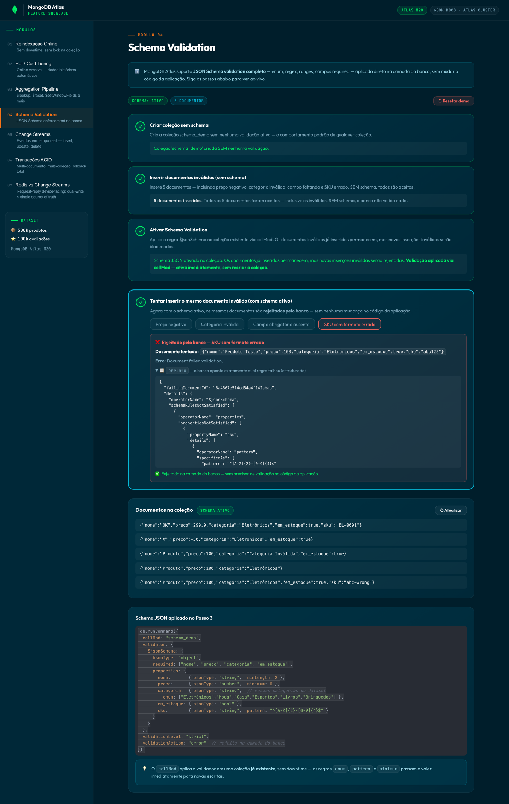
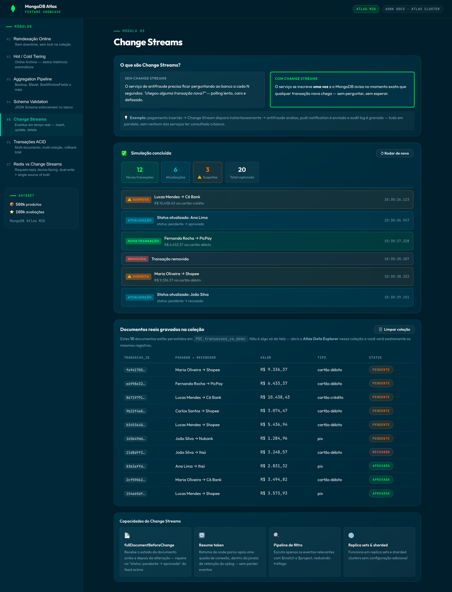
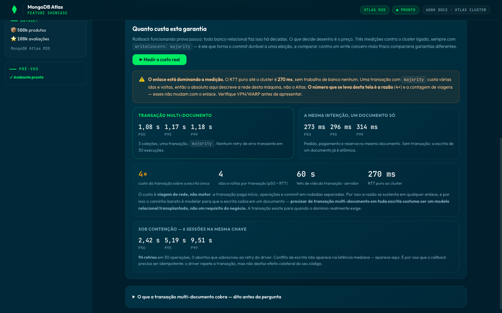
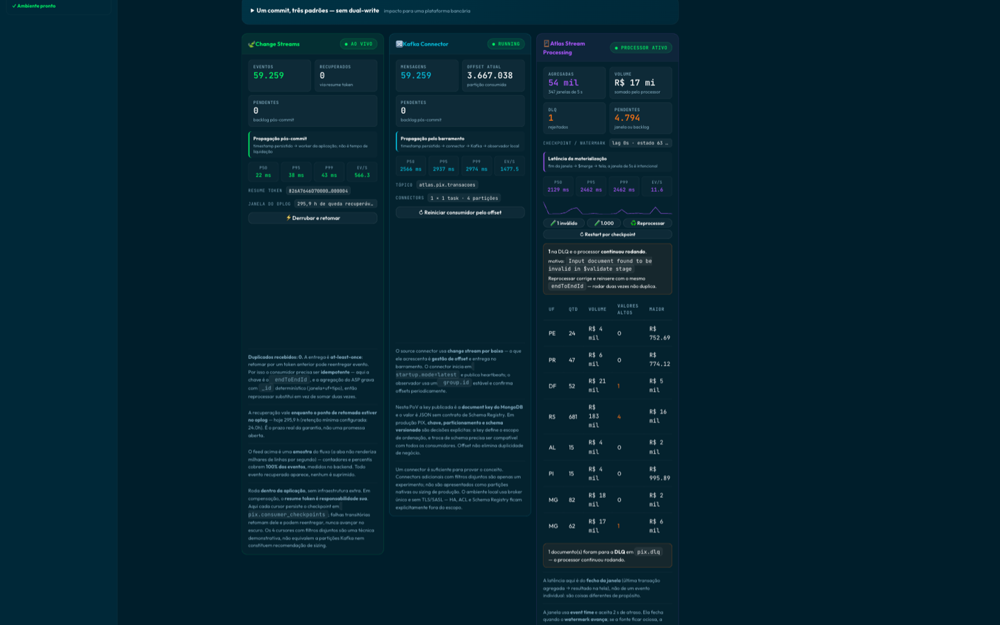

# MongoDB Atlas feature showcase

Seven Atlas capabilities, one page each, running against a real cluster. Build an index and watch reads keep flowing. Break a change stream and watch it resume from its token. Roll back a transaction and watch the documents return.

Nothing is mocked. If a piece is not configured, the UI says so instead of inventing a number.

FastAPI + React 18. The UI is in Brazilian Portuguese. No LLM.

## The modules

The app opens on a **thesis** page, not on module 01: none of the capabilities is exclusive to MongoDB, and the argument is not any single capability. It is the convergence of all of them over the same data, in the same cluster, in the same language. The page also states what the demo does *not* prove (it is not a competitive benchmark, does not estimate savings, and does not replace the warehouse).

| Module | What Atlas does |
|---|---|
| **01** Online reindexing | Rolling index build with no downtime. `live_monitor.py` prints read/write latency while it happens. |
| **02** Hot/cold tiering | Online Archive moves old documents to cheap storage, still queryable in a single namespace. |
| **03** Aggregation Pipeline | `$lookup`, `$facet`, `$unionWith`, `$setWindowFields`, `$bucketAuto`. |
| **04** Schema validation | `strict` rejects new violations; MongoDB 9.0 `constraint` checks and enforces the contract for existing data too. |
| **05** Change Streams | Ordered feed of inserts/updates/deletes with pre/post-images. |
| **06** ACID transactions | Multi-document transactions walked step by step, rollback included, and measured: `majority` latency, the cost over the same single-document write, and behavior under contention. |
| **07** Streaming | Change Streams, Kafka Connector, and Atlas Stream Processing over the same writes. |

The geospatial-risk module (formerly 08) became a standalone PoV: [`mongodb-atlas-geo-showcase`](https://github.com/adrianofratelli-glitch/mongodb-atlas-geo-showcase).

Each module states where its capability does **not** go, before anyone asks.

Every module has a deep link: `/#tese`, `/#agg`, `/#streams`, `/#tx`, …

**Module 01: the index is built while reads keep flowing:**



## Quick start

```bash
cd backend && python -m venv venv && source venv/bin/activate
pip install -r requirements.txt
cp .env.example .env          # MONGO_URI, optionally the Atlas API keys
python seed_data.py           # 100k products + 20k reviews
cd .. && ./start.sh            # API :8002 + UI :5174
```

The launcher uses a no-reload backend and an optimized frontend build by default. For reload/HMR development run `POV_DEV=1 ./start.sh`; the build is only redone when sources, lockfile, or configuration change.

Run `curl http://localhost:8002/preflight` before presenting. It checks the URI, cluster, collections, Atlas keys, and the mutation guard.

Once configured, `bin/overview` replaces all of that:

```bash
./scripts/prepare-demo.sh   # ahead of time (review it: it may reference the already-extracted Geo dataset)
./bin/overview              # preflight, backend, frontend, Kafka, ASP
./bin/overview --replay     # recorded fallback, nothing written to the cluster
./bin/overview down         # stops everything; the cluster is left untouched
```

**Run `overview down` when you finish**: a stream processor is billed per second. As a safety net, `up` already schedules that `down` for 45 minutes later; `overview manter` cancels it and `overview adiar 30` reschedules.

Details: [Streaming setup](docs/setup-streaming.md) · [reference](docs/reference.md) (Portuguese).

## Module 07: three consumers, one write

Change Streams in the application, the Kafka Connector publishing to a real broker, and Atlas Stream Processing aggregating 5s windows, all over the same writes. The flow has two channels: `PIX` (no coordinate, because a PIX transfer has none) and `CARTAO_PRESENCIAL` (card-present, with the acquirer terminal's coordinate, which is what makes the geospatial module defensible).



**Break it on purpose.** Four buttons sit next to the generator: *kill the connector* (stops mid-flow and resumes from the stored offset), *inject an invalid event* (a string `valor`, diverted to the DLQ by the processor's `$validate`), *publish an incompatible schema version* (the required field `valor` renamed to `amount`, the change a Schema Registry would refuse), and *force a primary failover* (Atlas's test failover, on the cluster, under load).

Then watch the reconciliation close anyway, and it checks three things, not one: **count** (nothing missing), **value** summed in integer cents (nothing transformed along the way), and an XOR **digest** of the set of `endToEndId` (the paths became the same documents, not merely the same quantity). Measured through a real election: 332,568 documents, R$ 104,486,759.65 identical across the three paths, 0 writes rejected after driver retry, 0 duplicates.



Delivery is at-least-once, stated above the numbers and not in a footnote: after a resume the same event may arrive twice, and the unique index on `endToEndId` is what makes that safe. Ordering holds within a partition, not across partitions.

**What did it cost?** A throughput number alone invites the wrong reading (*so that is all Atlas does?*) because it never says whose ceiling was reached. The page reads the primary's CPU through the Atlas Admin API, clipped to the run's own window, and places it next to the TPS that produced it: **~1,600 TPS sustained for two minutes on an M20, with 29–53% primary CPU across runs** (the panel always shows the run in front of it, never a stored number). Two traps live here, and both were found by measuring, not assuming. Atlas publishes process metrics with a one-to-two-minute delay, so a panel queried right after a 30s run describes the cluster *before* the load; it now says `metricas_pendentes` instead of concluding. And a run shorter than the one-minute publication interval is averaged with the rest of that idle minute: the same load read 43% when it fell inside one bucket and 15% when it straddled two, so short runs are labelled as a floor.

The last panel answers the question that comes after *does it work?*: **what drops out of the design**. It compares the components each path requires, without inventing savings. The Kafka row stays correct whenever the event must reach systems outside Atlas, which is why it is in the demo, working.

The geospatial-risk module (formerly 08: retrospective impossible-travel investigation and the five geospatial query operators) was extracted to the standalone repository [`mongodb-atlas-geo-showcase`](https://github.com/adrianofratelli-glitch/mongodb-atlas-geo-showcase) on 2026-09-11.

## More screenshots

| Hot/cold tiering | Aggregation Pipeline |
|---|---|
|  |  |

| Schema validation | Change Streams |
|---|---|
|  |  |

| ACID transactions | Module 07, three columns |
|---|---|
|  |  |

## Security

Some of these demos destroy real things: they drop indexes, run `collMod` on validation rules, and create and delete Online Archives. That is why the blast radius stays local: the launcher listens on `127.0.0.1`, browser mutations are only accepted from configured origins, remote mutations require `DEMO_ADMIN_TOKEN`, bodies are size-limited, and errors return a request id instead of a trace.

The application also closes the streaming client through FastAPI's lifespan and returns browser-hardening headers. `/api/health` stays public; mutation authorization does not make the embedded Kafka lab production-ready.

**Never point this at anything other than a disposable demo cluster.**

On a shared network, set a long, random `DEMO_ADMIN_TOKEN` in `backend/.env` and mirror it as `VITE_DEMO_API_TOKEN`. The embedded Kafka stack is a single-node lab, with no TLS, SASL, ACLs, or Schema Registry.

## Stack

Python 3.11 · FastAPI · PyMongo · React 18 · Vite · MongoDB Atlas. Module 07 optionally needs a local Kafka broker and an ASP instance.

```bash
pip install -r backend/requirements-dev.txt
pytest             # 165 unit tests, stubbed Mongo, no cluster needed
ruff check backend
```

[`ARCHITECTURE.md`](ARCHITECTURE.md)

## License

MIT
