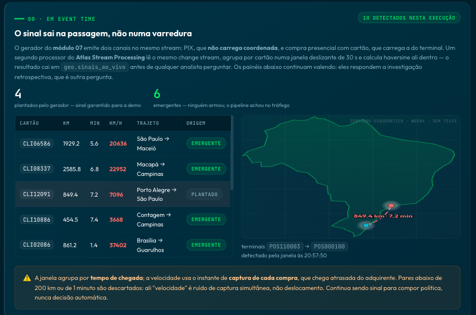

# Geographic risk module — setup

How to materialize the `geo` dataset and its Atlas Search index, plus what the
module does and does not claim.

Back to the [README](../README.md).

The Geo module runs against its own database (`geo`, override with `GEO_DB`), so
it never touches the `POC` or `pix` collections. Materialize it before the demo;
`overview` only runs the fast, read-only check:

```bash
./scripts/prepare-demo.sh             # run ahead of the presentation
python scripts/seed_geo.py            # 2,000 clients × 75 transactions = 150k docs
python scripts/seed_geo.py --drop     # recreate from scratch
python scripts/seed_geo.py --ensure   # keep if current; recreate if stale/incomplete
./scripts/create_search_index_geo.sh  # create/update and wait until READY
```

The generator is seeded with a fixed value and carries a dataset version, so every `endToEndId` is stable and
the unique index rejects re-inserts: running the seed twice leaves 150k
documents, not 300k. Points are gaussian clusters around 40 real Brazilian
municipalities weighted by population — uniformly random coordinates inside the
country's bounding box look obviously fake on a projector.

Location is never presented as a PIX field. Every point in this dataset is a
card-present purchase, and its coordinate belongs to the acquirer's terminal —
registered data, not the customer's phone. That distinction is the whole
argument: a terminal's position is not controlled by whoever is paying, though
it can still be stale or wrong in the registry. Provenance travels with the
point (terminal id, channel, source, quality) so the signal never looks like a
fact without an origin.

Forty clients get a deliberately impossible pair: two transactions roughly five
minutes and 700+ km apart. Their IDs are written to
`backend/data/fraud_seeds.json` so the impossible-travel panel has a guaranteed
result on stage.

## The signal in event time

The panel that opens the module does not scan history at all. It reads
`geo.sinais_ao_vivo`, which the `geoSinais30s` stream processor fills while
module 07 is running: it groups the card channel by cardholder in a 30-second
hopping window and runs haversine in MQL right there, inside the window.



Two counters, deliberately kept apart. The generator injects a pair every six
seconds so the stage always has something to show — those are the *planted*
ones. Anything else came out of ordinary traffic and was found by the pipeline,
not arranged for it. Presenting one total would turn the guarantee into the
evidence, which it is not.

A speed threshold on its own is a false-positive machine: two purchases 20 km
apart captured seconds apart read as 1,343 km/h. The signal therefore needs
three conditions — km/h above the limit, at least 200 km of distance, and at
least a minute between the two captures. Below those, "speed" is simultaneous
capture, not travel.

Note the two timestamps in the card channel: `ts` is when the event entered the
stream (also the TTL field), while `compradaEm` is when the purchase happened at
the terminal, which can be minutes earlier because acquirer capture lags. The
speed is computed from `compradaEm`. Putting that back-dated instant into `ts`
made the TTL delete the older half of a pair before reconciliation ran, and the
source then counted fewer than the consumers — expiry that looks exactly like
loss.
The result is explicitly a retrospective risk signal, not a fraud decision or
an inline payment-blocking control. Production still needs provenance validation,
anti-spoofing, multiple-device handling, LGPD controls and policy calibration.

Indexes created by the seed:

| Index | Used by |
|---|---|
| `cliente_status_local_idx` — `{clienteId: 1, status: 1, local: "2dsphere"}` | Demo A, the compound plan |
| `local_2dsphere_idx` — `{local: "2dsphere"}` | Demo A, the geo-only plan it is compared against |
| `cliente_ts_idx` — `{clienteId: 1, ts: 1}` | Demo B, `$setWindowFields` partition + sort |
| `categoria_local_idx` — `{"estabelecimento.categoria": 1, local: "2dsphere"}` | category-scoped geo queries |
| `uf_ts_idx` — `{uf: 1, ts: -1}` | regional slicing |
| `e2e_unq_idx` — unique `{endToEndId: 1}` | seed idempotency |

## The Atlas Search index

Demo C needs one Atlas Search index. Create it with:

```bash
./scripts/create_search_index_geo.sh
```

Until it reports `READY`, the search panel renders a "não configurado" notice
rather than inventing results. The definition it applies:

```json
{
  "mappings": {
    "dynamic": false,
    "fields": {
      "estabelecimento": {
        "type": "document",
        "fields": {
          "nome": { "type": "string", "analyzer": "lucene.portuguese" },
          "categoria": [{ "type": "token" }, { "type": "stringFacet" }]
        }
      },
      "uf": [{ "type": "token" }, { "type": "stringFacet" }],
      "local": { "type": "geo" }
    }
  }
}
```

`categoria` and `uf` are indexed twice on purpose: `token` serves the exact
filter, `stringFacet` serves the `$searchMeta` facet.

## What the module does not claim

The page says this out loud, and so does this document: MongoDB answers
geospatial *predicates* — is this inside, does it cross, what is nearby. It has
no geometry algebra (no buffer, union, intersection or area), only WGS84 with
no reprojection, and no raster, topology or routing. `$geoNear` must be the
first pipeline stage, and `$vectorSearch`'s `filter` does not accept geospatial
operators at all. Workloads that require geometry construction, topology,
routing or heavy GIS analysis need a dedicated geospatial system.

