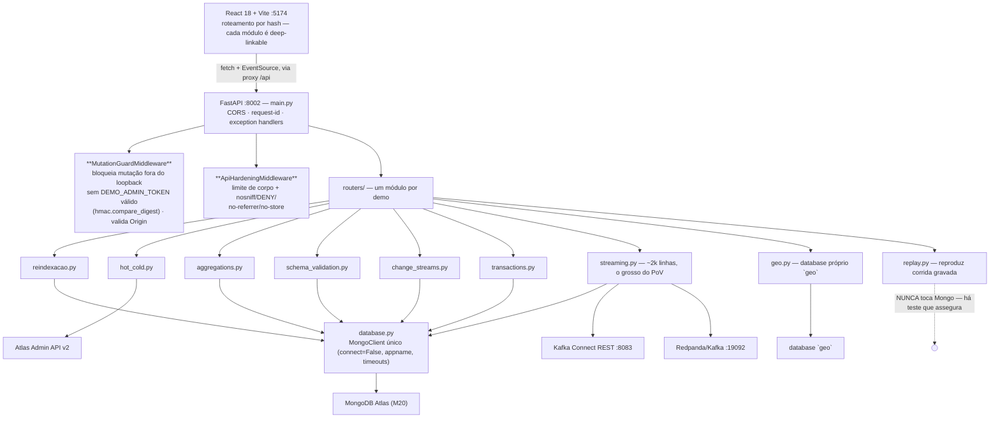
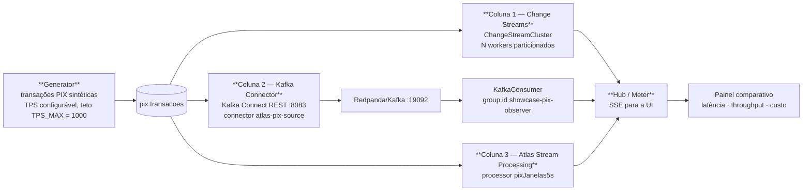

# MongoDB Atlas Feature Showcase — Oito Capacidades do Atlas contra um Cluster Real

PoV interativo que exercita oito capacidades centrais do Atlas **contra um cluster de verdade**, não simulação: Reindexação Online, Hot/Cold Tiering (Online Archive), Aggregation Pipeline, Schema Validation, Change Streams, Transações ACID, um módulo de Streaming comparando três abordagens de captura, e um módulo Geo.

**Não tem LLM nenhum aqui.** É o PoV que responde "o Atlas aguenta / o Atlas faz?" com medição, não com slide.

Repositório público: `adrianofratelli-glitch/mongodb-atlas-feature-showcase`.

---

## 1. Arquitetura

```
React 18 + Vite (frontend/, :5174) --fetch + EventSource--> FastAPI (backend/main.py, :8002) --> PyMongo --> MongoDB Atlas
                                                                     |-> Atlas Admin API v2 (só Online Archive)
                                                                     |-> Kafka Connect REST :8083 (Streaming, coluna 2)
                                                                     \-> aiokafka -> Redpanda/Kafka :19092 (opcional)
```



O dev server do Vite faz proxy de `/api` para `http://localhost:8002` **removendo o prefixo** — toda chamada do browser, SSE incluído, passa por esse proxy.

Detalhe que explica um design que parece estranho à primeira vista: o `MutationGuardMiddleware` ignora métodos seguros, e é por isso que **todos os endpoints SSE são `GET`** — `EventSource` não consegue enviar o header `X-Demo-Token`.

---

## 2. Os módulos

| # | Módulo | O que prova |
|---|---|---|
| 01 | **Reindexação Online** | Índice é construído com o cluster servindo tráfego. `live_monitor.py` no terminal mostra leitura/escrita continuando durante o build. |
| 02 | **Hot/Cold Tiering** | Online Archive move dado frio para storage barato mantendo a query unificada. Único módulo que usa a Atlas Admin API v2. Exige M10+. |
| 03 | **Aggregation Pipeline** | Transformação e análise no servidor, sem trazer dado para a aplicação. |
| 04 | **Schema Validation** | `$jsonSchema` + `collMod`: o banco rejeita documento fora do contrato. Flexível não é bagunça. |
| 05 | **Change Streams** | Reação a mudança sem polling. Exige replica set (todo tier Atlas qualifica). |
| 06 | **Transações ACID** | Multi-documento com garantia. Exige MongoDB 4.0+. |
| 07 | **Streaming** | Três colunas lado a lado: Change Streams / MongoDB Kafka Connector / Atlas Stream Processing. |
| 08 | **Geo** | `2dsphere` composto, viagem impossível, geo + Atlas Search. Database próprio (`geo`), nunca toca `POC`/`pix`. |

---

## 3. Módulo 07 — Streaming e o replay gravado

`routers/streaming.py` é o maior arquivo do repositório (~2k linhas) e concentra: gerador de transações PIX, `Hub`/`Meter` de SSE, o par `ChangeStreamWorker`/`ChangeStreamCluster` (N workers particionados), `KafkaConsumer`, `AspWatcher`, mais os endpoints de sonda de leitura, janela de oplog, cluster/rede/custo e preflight.



Colunas 2 e 3 degradam para um painel `não configurado` quando as variáveis de ambiente estão ausentes — a página nunca quebra por falta de Kafka local.

### Por que existe um modo replay (e por que ele não tem modo ao vivo)

`routers/replay.py` **reproduz uma corrida real gravada**, sob `/replay/*`, espelhando os caminhos de `/streaming/*` para o frontend só trocar o prefixo. Um único botão **▶ Play** move o relógio de reprodução.

O motivo é operacional e vale citar em cliente: M20/M30 são *burstable*, e o auto-scaling do Atlas dispara em CPU **relativa** (`NORMALIZED_AUTO_SCALE_SYSTEM_CPU > 0.75`). Medimos 17,6% de CPU absoluta sendo lida como 88% relativa, e o cluster escalou **com o gerador já parado**, só pelo polling do dashboard. O replay resolve isso: a página funciona com o cluster pausado.

Regras do replay, todas deliberadas:

- Ele **nunca toca o MongoDB** — há um teste que garante isso.
- Todo payload carrega `replay: true`.
- `/replay/manifest` responde 200 com `disponivel: false` quando não há gravação.
- Os streams SSE mandam `: keepalive` a cada 10s. Sem isso, streams vazados esgotam o orçamento de conexões por host do browser e os fetches estouram em 30s.
- Botões que agem no ambiente ficam desabilitados, e a página exibe um badge permanente de uma linha.

**Os números são medição, não simulação. Nunca apresentar um replay como corrida ao vivo.**

Gravação nova: `scripts/capture_replay.py` → `backend/data/replay_streaming.json`.

---

## 4. Módulo 08 — Geo

Database próprio (`geo`), isolado de `POC` e `pix`. Três endpoints:

- **`explain-compare`** — dois `hint` diferentes no mesmo `$geoWithin`, comparando planos de execução.
- **`impossible-travel`** — `$setWindowFields` + `$shift` + haversine **em MQL puro**. Nada de pós-processamento em Python.
- **`search`** — um único `$search` combinando texto + `geoWithin` + facetas. Degrada para `nao_configurado` sem o índice.

`data/fraud_seeds.json` guarda os IDs de cliente cujos pares de viagem impossível o seed plantou — garante resultado em cena, sem depender de sorte.

`scripts/seed_geo.py` gera 150k transações georreferenciadas (clusters gaussianos em torno de 40 municípios reais). **Idempotente** por seed fixa de RNG + índice único em `endToEndId`: rodar duas vezes não duplica a coleção.

### O que o módulo Geo NÃO faz (dito em voz alta na própria página)

Só **predicados** geoespaciais. Sem álgebra de geometria — nada de buffer, união, interseção, área. Só WGS84. Sem raster, sem topologia. `$geoNear` tem que ser o primeiro estágio do pipeline, e o `filter` do `$vectorSearch` rejeita operadores geoespaciais. **Não ampliar essa alegação em silêncio.**

O mapa é **SVG inline com projeção escrita à mão**. Sem Leaflet, Mapbox ou tiles, sem dependência nova no frontend — o módulo renderiza e funciona com a rede externa bloqueada. A única requisição externa do app é o link do Google Fonts em `frontend/index.html` (pré-existente); sem ele, a tipografia cai para fonte de sistema e nada mais muda.

---

## 5. Backend, arquivo por arquivo

| Arquivo | Responsabilidade |
|---|---|
| `main.py` | App FastAPI, CORS, middleware de request-id, exception handlers, wiring de routers, endpoints de ops (`/`, `/health/live`, `/health/ready`, `/preflight`, `/stats`) |
| `settings.py` | Dataclass congelada, lê todas as env vars uma vez. `settings.atlas_configured` libera o módulo de Online Archive |
| `database.py` | `MongoClient` único (`connect=False`, `appname`, timeouts explícitos) + `readiness()`. Cai para URI de localhost no import, para que `MONGO_URI` ausente apareça em `/health/ready` e não como erro de import |
| `security.py` | `MutationGuardMiddleware` + `ApiHardeningMiddleware` |
| `seed_data.py` | Gerador sintético de `produtos`/`avaliacoes`; também cria os índices que os módulos assumem |
| `scripts/seed_geo.py` | Dataset Geo |
| `scripts/cleanup-streaming-data.py` | Remoção **escopada** das coleções de demo do `pix`. Roda como segunda camada de limpeza no `ambiente.sh down` quando a API está fora. Tem que continuar escopada às coleções conhecidas |
| `live_monitor.py` | Monitor de latência de leitura/escrita no terminal; usado ao vivo para provar disponibilidade durante build de índice |

Frontend:

| Arquivo | Responsabilidade |
|---|---|
| `src/App.jsx` | Shell, sidebar, roteamento por hash (`/#agg`, `/#streams`, `/#tx`…) |
| `src/pages/` | Um componente por módulo |
| `src/components/` | `DemoFlow`, `QueryBlock` |
| `src/hooks/useApi.js` | Wrapper de fetch; envia `X-Demo-Token` de `VITE_DEMO_API_TOKEN` quando setado |
| `src/hooks/usePolling.js` | `useVisivel()` / `useIntervaloVisivel(fn, ms, ativo)` |
| `src/index.css` | Tokens de design MongoDB dark (`--bg-primary #001E2B`, `--accent #00ED64`, Outfit / JetBrains Mono) — mesma paleta dos outros PoVs do workspace |

### Disciplina de polling (medida)

Todo intervalo do app passa por `usePolling`. Nada faz polling com a aba escondida, e nada faz polling de dado que não pode mudar (snapshot gravado só se move enquanto o relógio de reprodução roda). `useSse` fecha o `EventSource` quando a aba esconde — um `EventSource` preso ocupa uma das ~6 conexões por host do browser, e os vazados faziam fetch comum estourar em 30s.

Medição: **48 requisições/20s → 1 quando parado, 0 com a aba escondida.**

---

## 6. Frontend

Este PoV não tem LLM. O produto **é** a tela: oito capacidades do Atlas, cada uma tendo que se provar sozinha na frente do cliente. Duas regras que valem para todos os módulos:

1. **Nada de dado inventado.** Todo número na tela veio de uma chamada real ao cluster. Se o Atlas não responder, a tela diz isso — não preenche com placeholder.
2. **A query fica visível.** Todo módulo mostra o pipeline que rodou (`QueryBlock`). Quem está assistindo consegue copiar e rodar no Compass.

### 6.1 Stack

Mínima de propósito. React 18 + Vite, JSX puro, CSS escrito à mão. A única dependência de UI é `react-syntax-highlighter`, que serve pra realçar os pipelines de agregação.

Não tem router, não tem biblioteca de estado, não tem UI kit. Navegação é por hash (`/#agg`, `/#streams`, `/#tx`), lida no boot e reagindo a `hashchange` — o suficiente pra deep-link funcionar quando eu preciso abrir um módulo específico direto na URL durante a apresentação.

`src/index.css` carrega os tokens dark do MongoDB (`--bg-primary #001E2B`, `--accent #00ED64`, Outfit + JetBrains Mono), a mesma paleta dos outros PoVs do workspace.

### 6.2 Uma página por capacidade

| Página | Capacidade | O que precisa ficar visível |
|---|---|---|
| `Reindexacao.jsx` | Build de índice sem downtime | O `live_monitor` continuar respondendo enquanto o índice constrói |
| `Aggregations.jsx` | `$lookup`, `$facet`, `$unionWith`, window functions | O pipeline ao lado do resultado |
| `ChangeStreams.jsx` | Change Streams | Evento chegando na tela no instante da escrita |
| `Streaming.jsx` | Atlas Stream Processing + Kafka | Três fluxos SSE simultâneos; é a maior página, 780 linhas |
| `Transactions.jsx` | Transações multi-documento | Commit e rollback, com o estado antes e depois |
| `HotCold.jsx` | Online Archive | Query atravessando dado quente e frio de forma transparente |
| `Geo.jsx` | Geoespacial | `explain` comparado com e sem índice 2dsphere |
| `SchemaValidation.jsx` | `$jsonSchema` | O banco recusando o documento malformado |

`DemoFlow` dá o passo a passo de cada módulo (o roteiro na própria tela, pra eu não depender de decorar), e `QueryBlock` mostra a query.

### 6.3 `useApi` — o hook que segura a demo

Todo fetch passa por `src/hooks/useApi.js`, e ele carrega mais decisão do que o tamanho sugere:

- **Timeout de 30s por requisição** (configurável até 300s, porque criar índice ou Online Archive demora), com `AbortController`.
- **Erro traduzido pra linguagem de operador**: `Failed to fetch` vira "API indisponível — verifique se o backend está rodando na porta 8002". Numa demo, "Failed to fetch" não ajuda ninguém.
- **Abort de navegação não vira erro.** Trocar de módulo cancela as requisições da tela anterior; isso é esperado e não pode pintar um toast vermelho falso.
- **Contador de pendentes** em vez de booleano, senão duas chamadas concorrentes fazem o loading piscar cedo demais.
- **`X-Demo-Token`** injetado de `VITE_DEMO_API_TOKEN` quando definido, casando com o hardening do backend.
- **Erro global por `CustomEvent('api-error')`** — o shell mostra o toast sem precisar passar callback por toda a árvore.

### 6.4 Disciplina de polling

Oito módulos com relógio próprio viram facilmente uma rajada de requisições. Todo intervalo do app passa por `usePolling`:

- `useVisivel()` — aba escondida, nada roda.
- `useIntervaloVisivel(fn, ms, ativo)` — o timer só existe enquanto a aba está visível **e** `ativo` é verdadeiro. Dispara uma vez ao reativar, pra tela não ficar com dado velho quando eu volto pra aba. A função fica numa `ref`, porque deixar a identidade dela na lista de dependências recria o timer a cada render — é o erro clássico que transforma um poll de 5s em rajada.

Nada faz polling de dado que não pode mudar: o snapshot gravado do módulo de streaming só avança enquanto o relógio de reprodução está rodando.

O `useSse` do `Streaming.jsx` fecha o `EventSource` quando a aba esconde, e **reconecta manualmente**. O `EventSource` só refaz a conexão sozinho em alguns casos, e cada um deles segura uma das ~6 conexões por host do browser — conexões vazadas faziam o fetch comum estourar em 30 segundos.

Resultado medido: **48 requisições/20s → 1 quando parado, 0 com a aba escondida.**

### 6.5 Build e proxy

```bash
cd frontend && npm run dev     # :5174, proxia /api -> :8002
cd frontend && npm run build
cd frontend && npm run check   # é o próprio build; não há lint/test aqui
```

O proxy do Vite reescreve `/api/x` para `/x` no backend — por isso os caminhos em `useApi` não carregam o prefixo. O alvo sai de `VITE_API_PROXY_TARGET`, com default `http://localhost:8002`.

---

## 7. Comandos

Entrypoint preferido — `bin/overview` resume o Atlas e sobe backend e frontend:

```bash
./bin/overview          # up
./bin/overview down     # pausa o cluster + para o processor ASP -> sem custo de compute
./bin/overview status
./bin/overview logs     # tail em $TMPDIR/overview-backend.log
./bin/overview --ao-vivo  # provisiona também o processor ASP e o Kafka local (para gravar corrida nova)
```

`bin/overview` delega a metade cloud/Kafka para `scripts/ambiente.sh {up,down,status}` (Atlas Admin API v2 + `scripts/kafka-local.sh`), que lê credenciais direto de `backend/.env`.

**Sempre `overview down` depois da demo — um processor ASP rodando cobra por segundo.**

Só a aplicação, sem orquestrar ambiente:
```bash
./start.sh --foreground   # backend :8002 + frontend :5174, ambos com polling de readiness
```

Backend isolado (de `backend/`, venv ativa, `.env` preenchido):
```bash
uvicorn main:app --reload --port 8002
python seed_data.py            # 100k produtos + 20k avaliacoes (suficiente para todos os módulos)
python seed_data.py --full     # 5M + 1M, escala cheia
```

Geo (da raiz, venv do backend ativa):
```bash
python scripts/seed_geo.py            # 150k transações georreferenciadas em geo.transacoes
python scripts/seed_geo.py --drop     # recria do zero
./scripts/create_search_index_geo.sh  # índice Atlas Search do painel de busca
```

Testes e lint (da raiz):
```bash
pip install -r backend/requirements-dev.txt
pytest                                              # testpaths = backend/tests, addopts -q
pytest backend/tests/test_streaming.py::test_name   # teste único
pytest -k particao                                  # por fragmento de nome
ruff check backend                                  # py311, line-length 120, lint select E9/F63/F7/F82
pip-audit -r backend/requirements.txt
```

Baseline atual: **105 testes passando**. Todos são unitários com Mongo stubado/monkeypatched — nenhum precisa de cluster ao vivo.

O CI (`.github/workflows/ci.yml`) roda exatamente isso a cada push/PR, mais `npm ci && npm run build && npm audit --audit-level=high` no frontend.

**Antes de qualquer demo:**
```bash
curl http://localhost:8002/preflight
```
Ele verifica `MONGO_URI`, alcance do cluster, as coleções `produtos`/`avaliacoes`, as credenciais da Atlas Admin API e o modo do mutation guard.

---

## 8. Ambiente

Copiar `backend/.env.example` para `backend/.env`:

**Base**
- `MONGO_URI`, `MONGO_DB` (default `POC`), `MONGO_TIMEOUT_MS` (default 8000).
- `ATLAS_PUBLIC_KEY`, `ATLAS_PRIVATE_KEY`, `ATLAS_PROJECT_ID`, `ATLAS_CLUSTER` — só para Hot/Cold Tiering (Online Archive, M10+).
- `DEMO_ADMIN_TOKEN` — necessário para permitir mutação fora do loopback; espelhar como `VITE_DEMO_API_TOKEN` em `frontend/.env`.
- `ALLOWED_ORIGINS` (default `http://localhost:5174,http://127.0.0.1:5174`), `MAX_REQUEST_BYTES` (default 1 MiB).

**Streaming** (lidas em `routers/streaming.py`, não em `settings.py`)
- `STREAMING_DB` (default `pix`), `KAFKA_BROKERS` (`localhost:19092`), `CONNECT_URL` (`http://localhost:8083`), `CONNECT_CONNECTOR_NAME` (`atlas-pix-source`).
- `ASP_ENABLED`, `ASP_CONNECTION_STRING`, `ASP_PROCESSOR_NAME` (`pixJanelas5s`), `ASP_CONNECTION_NAME` (`atlasCluster`).
- `KAFKA_CONSUMER_GROUP` (`showcase-pix-observer`) — o `group.id` do observador da UI; `scripts/kafka-local.sh` remove o mesmo grupo no teardown.
- Tuning de demo: `STREAMING_CS_PARTICOES` (workers de change stream, default 1 — suficiente para provar o conceito), `STREAMING_TTL_SEGUNDOS` (600), `STREAMING_CONCEPT_TPS` (200; a API limita o gerador a `TPS_MAX` = 1000), `STREAMING_PERFIL_VALORES` (`varejo`). Mais cursores/conectores é experimento explícito, **não recomendação de sizing**.

**Tier**
- `ATLAS_TIER_INICIAL` (default `M20`) — o tier em que cada demo começa; `ambiente.sh up` normaliza o cluster para ele, então o PoV nunca herda um tier escalado.
- `ATLAS_MIN_TIER` (default vazio) — piso de auto-scaling, não mexido a menos que setado.
- **O teto de auto-scaling nunca é modificado** — escalar para cima continua disponível. Manter a demo no tier de entrada é trabalho das correções do Streaming (índice em `run_id`, poll de reconciliação, TPS, TTL), não de um teto.

Duas regras do Atlas que é fácil errar, ambas retornando HTTP 400: `minInstanceSize` tem que ser **estritamente** menor que `maxInstanceSize` (ou seja, "fixar em M20 com auto-scaling ligado" é inexprimível), e cada tier tem disco máximo (M10 vai até 128 GB, então um cluster de 150 GB não pode ter piso M10).

**Geo** (lidas em `routers/geo.py`): `GEO_DB` (default `geo`), `GEO_SEARCH_INDEX` (default `idx_geo_estabelecimento`). Ambos os preflights de geo são opcionais e nunca reprovam o `/preflight`.

**Frontend**: `VITE_DEMO_API_TOKEN`, e `VITE_API_PROXY_TARGET` para apontar o proxy do Vite a outro backend.

Credenciais vivem só em `backend/.env` (gitignored). O frontend só enxerga `VITE_DEMO_API_TOKEN`.

---

## 9. Armadilhas

- **Vários endpoints são destrutivos por natureza** — derrubam índices, fazem `collMod` de schema, criam/apagam Online Archive. **Nunca apontar este PoV para nada além de um cluster de demo descartável.**
- Change Streams exigem replica set (todo tier Atlas qualifica); Transações exigem MongoDB 4.0+; Online Archive exige M10+.
- O mutation guard rejeita requisição com `Origin` fora de `ALLOWED_ORIGINS` — mudar a porta do frontend faz mutação começar a retornar 403.
- `scripts/ambiente.sh` parseia `backend/.env` com `grep`/`cut`. Valores entre aspas são tratados, mas valor contendo `#` ou quebra de linha quebra o script.
- Deixar o processor ASP rodando **custa por segundo mesmo ocioso**, e o cluster Atlas continua cobrando storage mesmo pausado. `overview down` cuida dos dois.

---

## 10. Ordem de leitura do repositório

`AGENTS.md` é o entrypoint curto de sessão, compartilhado por qualquer agente de código. `docs/SESSION_HANDOFF.md` é o detalhe por trás dele e o log de decisão corrente: o que mudou, por quê, o que o PoV prova, os não-objetivos explícitos, a baseline de validação e as queries de Graphify já preparadas. Só depois disso vale abrir o `ARCHITECTURE.md`, e mesmo assim só no endpoint/fluxo relevante.

A navegação por grafo já está gerada em `graphify-out/`. Antes de abrir o router de Streaming (que é grande), prefira `graphify query "<pergunta>" --budget 1200` ou `graphify affected "<nó>"`.

---

## 11. Convenções

- Textos de UI, docstrings do backend e mensagens de erro em **pt-BR**, por decisão (público brasileiro).
- Identificadores de código, README e documentação de engenharia em **inglês**.
